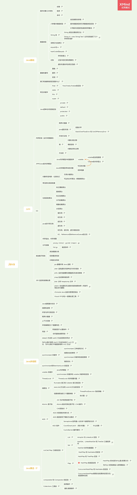

# Java

## Java基础

### 面向对象三大特性

- 封装

  封装把一个对象的属性私有化，同时提供一些可以被外界访问的属性的方法，如果属性不想被外界访问，我们大可不必提供方法给外界访问。但是如果一个类没有提供给外界访问的方法，那么这个类也没有什么意义了。
  

- 继承

  继承是使用已存在的类的定义作为基础建立新类的技术，新类的定义可以增加新的数据或新的功能，也可以用父类的功能，但不能选择性地继承父类。通过使用继承我们能够非常方便地复用以前的代码。
   
  关于继承如下 3 点请记住：
  子类拥有父类对象所有的属性和方法（包括私有属性和私有方法），但是父类中的私有属性和方法子类是无法访问，只是拥有。
  子类可以拥有自己属性和方法，即子类可以对父类进行扩展。
  子类可以用自己的方式实现父类的方法。（以后介绍）。
  

- 多态

  所谓多态就是指程序中定义的引用变量所指向的具体类型和通过该引用变量发出的方法调用在编程时并不确定，而是在程序运行期间才确定，即一个引用变量到底会指向哪个类的实例对象，该引用变量发出的方法调用到底是哪个类中实现的方法，必须在由程序运行期间才能决定。
  在 Java 中有两种形式可以实现多态：继承（多个子类对同一方法的重写）和接口（实现接口并覆盖接口中同一方法）。
  

### 数据类型

- 八种基本数据类型

  byte：Java中最小的数据类型，在内存中占8位(bit)，即1个字节，取值范围-128~127，默认值0
  short：短整型，在内存中占16位，即2个字节，取值范围-32768~32767，默认值0
  int：整型，用于存储整数，在内在中占32位，即4个字节，取值范围-2147483648~2147483647，默认值0
  long：长整型，在内存中占64位，即8个字节-263~263-1，默认值0L
  float：浮点型，在内存中占32位，即4个字节，用于存储带小数点的数字（与double的区别在于float类型有效小数点只有6~7位），默认值0
  double：双精度浮点型，用于存储带有小数点的数字，在内存中占64位，即8个字节，默认值0
  char：字符型，用于存储单个字符，占16位，即2个字节，取值范围0~65535，默认值为空
  boolean：布尔类型，占1个字节，用于判断真或假（仅有两个值，即true、false），默认值false
  

	- 自动装箱与拆箱

	  装箱：将基本类型用它们对应的引用类型包装起来；
	  拆箱：将包装类型转换为基本数据类型；
	  
	  

	- 基本数据类型和引用数据类型区别

	  基本数据类型在被创建时，在栈上给其划分一块内存，将数值直接存储在栈上。
	  引用数据类型在被创建时，首先要在栈上给其引用（句柄）分配一块内存，而对象的具体信息都存储在堆内存上，然后由栈上面的引用指向堆中对象的地址。
	  

	- 8 种基本类型的包装类和常量池

	  Java 基本类型的包装类的大部分都实现了常量池技术，即 Byte,Short,Integer,Long,Character,Boolean；前面 4 种包装类默认创建了数值[-128，127] 的相应类型的缓存数据，Character创建了数值在[0,127]范围的缓存数据，Boolean 直接返回True Or False。如果超出对应范围仍然会去创建新的对象。 为啥把缓存设置为[-128，127]区间？（参见issue/461）性能和资源之间的权衡。
	  
	  public static Boolean valueOf(boolean b) {
	      return (b ? TRUE : FALSE);
	  }
	  private static class CharacterCache {         
	      private CharacterCache(){}
	            
	      static final Character cache[] = new Character[127 + 1];          
	      static {             
	          for (int i = 0; i < cache.length; i++)                 
	              cache[i] = new Character((char)i);         
	      }   
	  }
	  两种浮点数类型的包装类 Float,Double 并没有实现常量池技术。
	  
	  		Integer i1 = 33;
	  		Integer i2 = 33;
	  		System.out.println(i1 == i2);// 输出 true
	  		Integer i11 = 333;
	  		Integer i22 = 333;
	  		System.out.println(i11 == i22);// 输出 false
	  		Double i3 = 1.2;
	  		Double i4 = 1.2;
	  		System.out.println(i3 == i4);// 输出 false
	  Integer 缓存源代码：
	  
	  /**
	  *此方法将始终缓存-128 到 127（包括端点）范围内的值，并可以缓存此范围之外的其他值。
	  */
	      public static Integer valueOf(int i) {
	          if (i >= IntegerCache.low && i <= IntegerCache.high)
	              return IntegerCache.cache[i + (-IntegerCache.low)];
	          return new Integer(i);
	      }
	  
	  应用场景：
	  
	  Integer i1=40；Java 在编译的时候会直接将代码封装成 Integer i1=Integer.valueOf(40);，从而使用常量池中的对象。
	  Integer i1 = new Integer(40);这种情况下会创建新的对象。
	    Integer i1 = 40;
	    Integer i2 = new Integer(40);
	    System.out.println(i1==i2);//输出 false
	  Integer 比较更丰富的一个例子:
	  
	    Integer i1 = 40;
	    Integer i2 = 40;
	    Integer i3 = 0;
	    Integer i4 = new Integer(40);
	    Integer i5 = new Integer(40);
	    Integer i6 = new Integer(0);
	    
	    System.out.println("i1=i2   " + (i1 == i2));
	    System.out.println("i1=i2+i3   " + (i1 == i2 + i3));
	    System.out.println("i1=i4   " + (i1 == i4));
	    System.out.println("i4=i5   " + (i4 == i5));
	    System.out.println("i4=i5+i6   " + (i4 == i5 + i6));   
	    System.out.println("40=i5+i6   " + (40 == i5 + i6));     
	  结果：
	  
	  i1=i2   true
	  i1=i2+i3   true
	  i1=i4   false
	  i4=i5   false
	  i4=i5+i6   true
	  40=i5+i6   true
	  解释：
	  
	  语句 i4 == i5 + i6，因为+这个操作符不适用于 Integer 对象，首先 i5 和 i6 进行自动拆箱操作，进行数值相加，即 i4 == 40。然后 Integer 对象无法与数值进行直接比较，所以 i4 自动拆箱转为 int 值 40，最终这条语句转为 40 == 40 进行数值比较。
	  
	  

- String 类

  String 对象的两种创建方式：
  
  String str1 = "abcd";//先检查字符串常量池中有没有"abcd"，如果字符串常量池中没有，则创建一个，然后 str1 指向字符串常量池中的对象，如果有，则直接将 str1 指向"abcd""；
  String str2 = new String("abcd");//堆中创建一个新的对象
  String str3 = new String("abcd");//堆中创建一个新的对象
  System.out.println(str1==str2);//false
  System.out.println(str2==str3);//false
  这两种不同的创建方法是有差别的。
  
  第一种方式是在常量池中拿对象；
  第二种方式是直接在堆内存空间创建一个新的对象。
  记住一点：只要使用 new 方法，便需要创建新的对象。
  
  再给大家一个图应该更容易理解，图片来源：https://www.journaldev.com/797/what-is-java-string-pool：
  
  
  

	- String 类型主要使用方法

	  直接使用双引号声明出来的 String 对象会直接存储在常量池中。
	  如果不是用双引号声明的 String 对象，可以使用 String 提供的 intern 方法。String.intern() 是一个 Native 方法，它的作用是：如果运行时常量池中已经包含一个等于此 String 对象内容的字符串，则返回常量池中该字符串的引用；如果没有，JDK1.7之前（不包含1.7）的处理方式是在常量池中创建与此 String 内容相同的字符串，并返回常量池中创建的字符串的引用，JDK1.7以及之后的处理方式是在常量池中记录此字符串的引用，并返回该引用。
	  	      String s1 = new String("计算机");
	  	      String s2 = s1.intern();
	  	      String s3 = "计算机";
	  	      System.out.println(s2);//计算机
	  	      System.out.println(s1 == s2);//false，因为一个是堆内存中的 String 对象一个是常量池中的 String 对象，
	  	      System.out.println(s3 == s2);//true，因为两个都是常量池中的 String 对象
	  字符串拼接:
	  
	  		  String str1 = "str";
	  		  String str2 = "ing";
	  		 
	  		  String str3 = "str" + "ing";//常量池中的对象
	  		  String str4 = str1 + str2; //在堆上创建的新的对象	  
	  		  String str5 = "string";//常量池中的对象
	  		  System.out.println(str3 == str4);//false
	  		  System.out.println(str3 == str5);//true
	  		  System.out.println(str4 == str5);//false
	  
	  尽量避免多个字符串拼接，因为这样会重新创建对象。如果需要改变字符串的话，可以使用 StringBuilder 或者 StringBuffer。
	  
	  
	  

	- String s1 = new String("abc");这句话创建了几个字符串对象？

	  将创建 1 或 2 个字符串。如果池中已存在字符串常量“abc”，则只会在堆空间创建一个字符串常量“abc”。如果池中没有字符串常量“abc”，那么它将首先在池中创建，然后在堆空间中创建，因此将创建总共 2 个字符串对象。
	  
	  验证：
	  
	  		String s1 = new String("abc");// 堆内存的地址值
	  		String s2 = "abc";
	  		System.out.println(s1 == s2);// 输出 false,因为一个是堆内存，一个是常量池的内存，故两者是不同的。
	  		System.out.println(s1.equals(s2));// 输出 true
	  结果：
	  
	  false
	  true
	  

- 深拷贝与浅拷贝

  浅拷贝：对基本数据类型进行值传递，对引用数据类型进行引用传递般的拷贝，此为浅拷贝。
  深拷贝：对基本数据类型进行值传递，对引用数据类型，创建一个新的对象，并复制其内容，此为深拷贝。
  
  

- equals与==

  == 比较的是值
  比较基本的数据类型，比较的是数值
  比较引用类型：比较引用指向的值（地址）
  equals
  默认比较也是地址，因为这个方法的最初定义在Object上，默认的实现就是比较地址
  自定义的类，如果需要比较的是内容，那么就要学String，重写equals方法
  代码案例：测试以下的每道题，你是否能够正确得到答案？
  String s1 = new String("zs");
   String s2 = new String("zs");
   System.out.println(s1 == s2);//false
   String s3 = "zs";
   String s4 = "zs";
   System.out.println(s3 == s4);//true
   System.out.println(s3 == s1);//false
   String s5 = "zszs";
   String s6 = s3+s4;//默认创建对象
   System.out.println(s5 == s6);//false
   final String s7 = "zs";//常量
   final String s8 = "zs";//常量
   String s9 = s7+s8;//常量加常量后编译器也会把它转为常量
   System.out.println(s5 == s9);//true
   final String s10 = s3+s4;//变量+变量，会重新new个对象
  System.out.println(s 5 == s10);//false
   
  
  说明：
  String 中的 equals 方法是被重写过的，因为 object 的 equals 方法是比较的对象的内存地址，而 String 的 equals 方法比较的是对象的值。
  当创建 String 类型的对象时，虚拟机会在常量池中查找有没有已经存在的值和要创建的值相同的对象，如果有就把它赋给当前引用。如果没有就在常量池中重新创建一个 String 对象。
  
  

- hashCode与equals

   
  hashCode（）介绍
   
  hashCode() 的作用是获取哈希码，也称为散列码；它实际上是返回一个 int 整数。这个哈希码的作用是确定该对象在哈希表中的索引位置。hashCode() 定义在 JDK 的 Object.java 中，这就意味着 Java 中的任何类都包含有 hashCode() 函数。
  散列表存储的是键值对(key-value)，它的特点是：能根据“键”快速的检索出对应的“值”。这其中就利用到了散列码！（可以快速找到所需要的对象）
   
  为什么要有 hashCode
   
  我们先以“HashSet 如何检查重复”为例子来说明为什么要有 hashCode： 当你把对象加入 HashSet 时，HashSet 会先计算对象的 hashcode 值来判断对象加入的位置，同时也会与该位置其他已经加入的对象的 hashcode 值作比较，如果没有相符的 hashcode，HashSet 会假设对象没有重复出现。但是如果发现有相同 hashcode 值的对象，这时会调用 equals()方法来检查 hashcode 相等的对象是否真的相同。如果两者相同，HashSet 就不会让其加入操作成功。如果不同的话，就会重新散列到其他位置。（摘自我的 Java 启蒙书《Head first java》第二版）。这样我们就大大减少了 equals 的次数，相应就大大提高了执行速度。
   
  通过我们可以看出：hashCode() 的作用就是获取哈希码，也称为散列码；它实际上是返回一个 int 整数。这个哈希码的作用是确定该对象在哈希表中的索引位置。**hashCode()在散列表中才有用，在其它情况下没用**。在散列表中 hashCode() 的作用是获取对象的散列码，进而确定该对象在散列表中的位置。
   
  hashCode（）与 equals（）的相关规定
   
  如果两个对象相等，则 hashcode 一定也是相同的
  两个对象相等,对两个对象分别调用 equals 方法都返回 true
  两个对象有相同的 hashcode 值，它们也不一定是相等的
  因此，equals 方法被覆盖过，则 hashCode 方法也必须被覆盖
  hashCode() 的默认行为是对堆上的对象产生独特值。如果没有重写 hashCode()，则该 class 的两个对象无论如何都不会相等（即使这两个对象指向相同的数据）
  

- 泛型

	- 存在的意义

	  1.适用于多种数据类型执行相同的代码（代码复用）。
	  2.泛型中的类型在使用时指定，不需要强制类型转换（类型安全，编译器会检查类型）。
	  

	- 泛型中的约束和局限性

	  1.不能实例化泛型类。
	  2.静态变量或方法不能引用泛型类型变量，但静态泛型方法是可以的。
	  3.基本类型无法作为泛型类型。
	  4.无法使用instanceof关键字判断泛型类的类型。
	  5.泛型类的原生类型与所传递的泛型无关，无论传递什么类型，原生类是一样的。
	  6.泛型数组可以声明，但无法实例化
	  7.泛型类不能继承Exception或者Throwable
	  8.不能捕获泛型类型限定的异常但可以将泛型限定异常抛出。
	  

	- 虚拟机是如何实现泛型的

	  Java泛型是Java1.5之后引入的，为了向下兼容。Java中的泛型更多的看起来是编译期用的，Java中泛型在运行期是不可见的，会被擦除为它的上级类型。如果没有限定的泛型参数类型，就会被替换为Object。
	  

### 重载和重写

- 重载

  重载就是同样的一个方法能够根据输入数据的不同，做出不同的处理。
  发生在同一个类中，方法名必须相同，参数类型不同、个数不同、顺序不同，方法返回值和访问修饰符可以不同。
  

- 重写

  重写就是当子类继承自父类的相同方法，输入数据一样，但要做出有别于父类的响应时，你就要覆盖父类方法。
  重写发生在运行期，是子类对父类的允许访问的方法的实现过程进行重新编写。
  返回值类型、方法名、参数列表必须相同，抛出的异常范围小于等于父类，访问修饰符范围大于等于父类。
  如果父类方法访问修饰符为 private/final/static 则子类就不能重写该方法，但是被 static 修饰的方法能够被再次声明。
  构造方法无法被重写
  综上：重写就是子类对父类方法的重新改造，外部样子不能改变，内部逻辑可以改变 。
  

- 区别

   | 区别点 | 重载方法 | 重写方法
   | 发生范围 | 同一个类 | 子类 中
   | 参数列表 | 必须修改 | 一定不能修改
   | 返回类型 | 可修改 | 一定不能修改
   | 异常 | 可修改 | 可以减少或删除，一定不能抛出新的或者更广的异常
   | 访问修饰符 | 可修改 | 一定不能做更严格的限制（可以降低限制）
   | 发生阶段 | 编译期 | 运行期
  

### 接口和抽象类的区别是什么？

接口的方法默认是 public，所有方法在接口中不能有实现(Java 8 开始接口方法可以有默认实现），而抽象类可以有非抽象的方法。
接口中除了 static、final 变量，不能有其他变量，而抽象类中则不一定。
一个类可以实现多个接口，但只能实现一个抽象类。接口自己本身可以通过 extends 关键字扩展多个接口。
接口方法默认修饰符是 public，抽象方法可以有 public、protected 和 default 这些修饰符（抽象方法就是为了被重写所以不能使用 private 关键字修饰！）。
从设计层面来说，抽象是对类的抽象，是一种模板设计，而接口是对行为的抽象，是一种行为的规范。
 
 
备注：
在 JDK8 中，接口也可以定义静态方法，可以直接用接口名调用。实现类和实现是不可以调用的。如果同时实现两个接口，接口中定义了一样的默认方法，则必须重写，不然会报错。(详见 issue:https://github.com/Snailclimb/JavaGuide/issues/146。
jdk9 的接口被允许定义私有方法 。
 
 
总结一下 jdk7~jdk9 Java 中接口概念的变化（相关阅读）：
在 jdk 7 或更早版本中，接口里面只能有常量变量和抽象方法。这些接口方法必须由选择实现接口的类实现。
jdk8 的时候接口可以有默认方法和静态方法功能。
Jdk 9 在接口中引入了私有方法和私有静态方法。

### 常见关键字

- final

  final关键字主要用在三个地方：变量、方法、类
  | 使用对象  |  作用
   | 类             | final类不能被继承，成员方法默认都是final
   | 方法         | 方法锁定，防止继承类修改。 高效。编译器在遇到调用final方法时候会转入内嵌机制，大大提高执行效率。
   | 变量         | 值不能改变
  

	- final,finally,finalize的区别

	  final修饰符（关键字）如果一个类被申明为final,意味着它不能再派生出新的子类，不能作为父类被继承，因此一个类不能既被声明为abstract的，又被声明为final的。将变量和方法声明为final变量的，可以保证它们在使用中不被改变。被声明为final的变量必须在申明时给定初值，而在以后的引用中只能读取不可以被修改。被申明为final的方法也同样只能使用不能重载。
	   
	  finally在异常处理时提供finally块来执行任何清除操作。如果抛出一个异常，那么相匹配的catch子句就会执行，然后控制就会进入finally块（如果有的话）。
	   
	  finalize方法名。java技术允许使用finalize()方法在垃圾收集器将对象从内存中清除出去之前做好必要的清理工作。这个方法是由垃圾收集器在确定这个对象没有被引用的情况下对这个对象的调用。它是在object类中定义的，因此所有的类都继承了它。子类覆盖finalize（）方法以整理系统资源或者执行其他清理工作。finalize()方法是在垃圾收集器删除对象之前对这个对象的调用
	  

- static

  static表示“全局”或者“静态”的意思，被static修饰的成员变量和成员方法独立于该类的任何对象，被所有对象实例共享。
   | 使用场景 | 作用
   | 成员变量 | 变量属于类，只在内存中有一份
   | 成员方法 | 静态方法中不能用this和super关键字，只能访问所属类的静态成员变量和成员方法
   | 静态代码块 | 在类中独立于类成员的static语句块，静态代码块只执行一次(执行顺序：静态代码块—>非静态代码块—>构造方法)
   | 静态内部类 | 静态内部类（static修饰类的话只能修饰内部类）
  

- this

  this关键字用于引用类的当前实例。 例如：
  class Manager {
       Employees[] employees;
       void manageEmployees() {
           int totalEmp = this.employees.length;
           System.out.println("Total employees: " + totalEmp);
           this.report();
       }
       void report() { }
   }
  this.employees.length：访问类Manager的当前实例的变量。
  this.report（）：调用类Manager的当前实例的方法。
  此关键字是可选的，这意味着如果上面的示例在不使用此关键字的情况下表现相同。 但是，使用此关键字可能会使代码更易读或易懂。
  

- super

  super关键字用于从子类访问父类的变量和方法。 例如：
  public class Super {
       protected int number;    
       protected showNumber() {
           System.out.println("number = " + number);
       }
   }
   public class Sub extends Super {
       void bar() {
           super.number = 10;
           super.showNumber();
       }
   }
  Sub 类访问父类成员变量 number 并调用其其父类 Super 的showNumber（） 方法。
  在构造器中使用 super（） 调用父类中的其他构造方法时，该语句必须处于构造器的首行，否则编译器会报错。另外，this 调用本类中的其他构造方法时，也要放在首行。
  this、super不能用在static方法中。
  

### Java四种访问权限区别

- prviate

  
   Java语言中对访问权限限制的最窄的修饰符，一般称之为“私有的”。被其修饰的属性以及方法只能被该类的对象访问，其子类不能访问，更不能允许跨包访问。
  

- default

  
  即不加任何访问修饰符，通常称为“默认访问权限“或者“包访问权限”。该模式下，只允许在同一个包中进行访问。
  

- protected

  
  介于public 和 private 之间的一种访问修饰符，一般称之为“保护访问权限”。被其修饰的属性以及方法只能被类本身的方法及子类访问，即使子类在不同的包中也可以访问。
  

- public

  
  
  Java语言中访问限制最宽的修饰符，一般称之为“公共的”。被其修饰的类、属性以及方法不仅可以跨类访问，而且允许跨包访问。
  

## JVM

### 内存区域（运行时数据区）

- 程序计数器

         程序计数器是一块较小的内存空间，可以看作是当前线程所执行的字节码的行号指示器。字节码解释器工作时通过改变这个计数器的值来选取下一条需要执行的字节码指令，分支、循环、跳转、异常处理、线程恢复等功能都需要依赖这个计数器来完。
        另外，为了线程切换后能恢复到正确的执行位置，每条线程都需要有一个独立的程序计数器，各线程之间计数器互不影响，独立存储，我们称这类内存区域为“线程私有”的内存。
   
  从上面的介绍中我们知道程序计数器主要有两个作用：
   
  字节码解释器通过改变程序计数器来依次读取指令，从而实现代码的流程控制，如：顺序执行、选择、循环、异常处理。
  在多线程的情况下，程序计数器用于记录当前线程执行的位置，从而当线程被切换回来的时候能够知道该线程上次运行到哪儿了。
   
  注意：程序计数器是唯一一个不会出现 OutOfMemoryError 的内存区域，它的生命周期随着线程的创建而创建，随着线程的结束而死亡。
  

- java虚拟机栈

  Java 虚拟机栈是由一个个栈帧组成，而每个栈帧中都拥有：局部变量表、操作数栈、动态链接、方法出口信息。
  

	- 逃逸分析
	- StackOverFlowError 和 OutOfMemoryError

	  StackOverFlowError： 若 Java 虚拟机栈的内存大小不允许动态扩展，那么当线程请求栈的深度超过当前 Java 虚拟机栈的最大深度的时候，就抛出 StackOverFlowError 错误。
	  OutOfMemoryError： Java 虚拟机栈的内存大小可以动态扩展， 如果虚拟机在动态扩展栈时无法申请到足够的内存空间，则抛出OutOfMemoryError异常异常。
	  
	  
	  
	  

- 本地方法栈

  和虚拟机栈所发挥的作用非常相似，区别是： 虚拟机栈为虚拟机执行 Java 方法 （也就是字节码）服务，而本地方法栈则为虚拟机使用到的 Native 方法服务。 在 HotSpot 虚拟机中和 Java 虚拟机栈合二为一。
  
  本地方法被执行的时候，在本地方法栈也会创建一个栈帧，用于存放该本地方法的局部变量表、操作数栈、动态链接、出口信息。
  
  方法执行完毕后相应的栈帧也会出栈并释放内存空间，也会出现 StackOverFlowError 和 OutOfMemoryError 两种错误。
  
  

- 堆

  Java 虚拟机所管理的内存中最大的一块，Java 堆是所有线程共享的一块内存区域，在虚拟机启动时创建。此内存区域的唯一目的就是存放对象实例，几乎所有的对象实例以及数组都在这里分配内存。
  
  Java世界中“几乎”所有的对象都在堆中分配，但是，随着JIT编译期的发展与逃逸分析技术逐渐成熟，栈上分配、标量替换优化技术将会导致一些微妙的变化，所有的对象都分配到堆上也渐渐变得不那么“绝对”了。从jdk 1.7开始已经默认开启逃逸分析，如果某些方法中的对象引用没有被返回或者未被外面使用（也就是未逃逸出去），那么对象可以直接在栈上分配内存。
  
  

	- 对象分配过程
	- 堆的结构

	  Java 堆是垃圾收集器管理的主要区域，因此也被称作GC 堆（Garbage Collected Heap）.从垃圾回收的角度，由于现在收集器基本都采用分代垃圾收集算法，所以 Java 堆还可以细分为：新生代和老年代：再细致一点有：Eden 空间、From Survivor、To Survivor 空间等。进一步划分的目的是更好地回收内存，或者更快地分配内存。
	  
	  在 JDK 7 版本及JDK 7 版本之前，堆内存被通常被分为下面三部分：
	  
	  新生代内存(Young Generation)
	  老生代(Old Generation)
	  永生代(Permanent Generation)
	  
	  JDK 8 版本之后方法区（HotSpot 的永久代）被彻底移除了（JDK1.7 就已经开始了），取而代之是元空间，元空间使用的是直接内存。
	  
	  
	  上图所示的 Eden 区、两个 Survivor 区都属于新生代（为了区分，这两个 Survivor 区域按照顺序被命名为 from 和 to），中间一层属于老年代。
	  
	  大部分情况，对象都会首先在 Eden 区域分配，在一次新生代垃圾回收后，如果对象还存活，则会进入 s0 或者 s1，并且对象的年龄还会加 1(Eden 区->Survivor 区后对象的初始年龄变为 1)，当它的年龄增加到一定程度（默认为 15 岁），就会被晋升到老年代中。对象晋升到老年代的年龄阈值，可以通过参数 -XX:MaxTenuringThreshold 来设置。
	  
	  修正（issue552）：“Hotspot遍历所有对象时，按照年龄从小到大对其所占用的大小进行累积，当累积的某个年龄大小超过了survivor区的一半时，取这个年龄和MaxTenuringThreshold中更小的一个值，作为新的晋升年龄阈值”。
	  
	  动态年龄计算的代码如下
	  
	  uint ageTable::compute_tenuring_threshold(size_t survivor_capacity) {
	  	//survivor_capacity是survivor空间的大小
	    size_t desired_survivor_size = (size_t)((((double) survivor_capacity)*TargetSurvivorRatio)/100);
	    size_t total = 0;
	    uint age = 1;
	    while (age < table_size) {
	      total += sizes[age];//sizes数组是每个年龄段对象大小
	      if (total > desired_survivor_size) break;
	      age++;
	    }
	    uint result = age < MaxTenuringThreshold ? age : MaxTenuringThreshold;
	  	...
	  }
	  
	  堆这里最容易出现的就是 OutOfMemoryError 错误，并且出现这种错误之后的表现形式还会有几种，比如：
	  
	  OutOfMemoryError: GC Overhead Limit Exceeded ： 当JVM花太多时间执行垃圾回收并且只能回收很少的堆空间时，就会发生此错误。
	  java.lang.OutOfMemoryError: Java heap space :假如在创建新的对象时, 堆内存中的空间不足以存放新创建的对象, 就会引发java.lang.OutOfMemoryError: Java heap space 错误。(和本机物理内存无关，和你配置的内存大小有关！)
	  ......
	  

	- 对象实例化过程

- 方法区

  方法区与 Java 堆一样，是各个线程共享的内存区域，它用于存储已被虚拟机加载的类信息、常量、静态变量、即时编译器编译后的代码等数据。虽然 Java 虚拟机规范把方法区描述为堆的一个逻辑部分，但是它却有一个别名叫做 Non-Heap（非堆），目的应该是与 Java 堆区分开来。
  

### JMM(Java的内存模型)

-  Java内存模型中的重排序

	- volatile

		- volatile的实现原理

		  有volatile变量修饰的共享变量进行写操作的时候会使用CPU提供的Lock前缀指令：
		  
		  将当前处理器缓存行的数据写回到系统内存
		  这个写回内存的操作会使在其他CPU里缓存了该内存地址的数据无效。
		  

		- volatile的内存语义

		  volatile变量自身具有下列特性：
		  
		  可见性。对一个volatile变量的读，总是能看到（任意线程）对这个volatile变量最后的写入。
		  原子性：对任意单个volatile变量的读/写具有原子性，但类似于volatile++这种复合操作不具有原子性。
		  

- Java内存模型带来的问题

	- 可见性问题
	- 竞争现象

### GC

- 对象存活判断：垃圾标记

	- 引用计数算法
	- 可达性分析算法（根搜索算法）

- 常见的垃圾回收器
- 垃圾回收算法

	- 标记清除算法
	- 复制算法
	- 标记压缩算法
	- 分代收集算法
	- 增量收集算法
	- 分区算法

- java的不同引用

	- 强引用

	  强引用是使用最普遍的引用。如果一个对象具有强引用，那垃圾回收器绝不会回收它。当内存空间不足，Java虚拟机宁愿抛出OutOfMemoryError错误，使程序异常终止，也不会靠随意回收具有强引用的对象来解决内存不足的问题。
	  

	- 软引用

	  如果一个对象只具有软引用，则内存空间足够，垃圾回收器就不会回收它；如果内存空间不足了，就会回收这些对象的内存。只要垃圾回收器没有回收它，该对象就可以被程序使用。
	  
	  所以，软引用可用来实现内存敏感的高速缓存。
	  
	  软引用可以和一个引用队列（ReferenceQueue）联合使用，如果软引用所引用的对象被垃圾回收器回收，Java虚拟机就会把这个软引用加入到与之关联的引用队列中。
	  

	- 弱引用

	  弱引用与软引用的区别在于：弱引用的对象拥有更短暂的生命周期。
	  
	  在垃圾回收器线程扫描它所管辖的内存区域的过程中，一旦发现了只具有弱引用的对象，不管当前内存空间足够与否，都会回收它的内存。不过，由于垃圾回收器是一个优先级很低的线程，因此不一定会很快发现那些只具有弱引用的对象。
	  
	  弱引用可以和一个引用队列（ReferenceQueue）联合使用，如果弱引用所引用的对象被垃圾回收，Java虚拟机就会把这个弱引用加入到与之关联的引用队列中。
	  

	- 虚引用

	  “虚引用”顾名思义，就是形同虚设，与其他几种引用都不同，虚引用并不会决定对象的生命周期。
	  
	  如果一个对象仅持有虚引用，那么它就和没有任何引用一样，在任何时候都可能被垃圾回收器回收。
	  

	- 软引用，弱引用，虚引用的区别
	- GC、Reference与ReferenceQueue的交互

	  A、 GC无法删除存在强引用的对象的内存。
	  
	  
	  B、 GC发现一个只有软引用的对象内存，那么：
	  ① SoftReference对象的referent 域被设置为null，从而使该对象不再引用heap对象。
	  ② SoftReference引用过的heap对象被声明为finalizable。
	  ③ 当 heap 对象的 finalize() 方法被运行而且该对象占用的内存被释放，SoftReference 对象就被添加到它的 ReferenceQueue（如果后者存在的话）。
	  
	  
	  C、 GC发现一个只有弱引用的对象内存，那么：
	  ① WeakReference对象的referent域被设置为null,从而使该对象不再引用heap对象。
	  ② WeakReference引用过的heap对象被声明为finalizable。
	  ③ 当heap对象的finalize()方法被运行而且该对象占用的内存被释放时，WeakReference对象就被添加到它的ReferenceQueue（如果后者存在的话）。
	  
	  
	  D、 GC发现一个只有虚引用的对象内存，那么：
	  ① PhantomReference引用过的heap对象被声明为finalizable。
	  ② PhantomReference在堆对象被释放之前就被添加到它的ReferenceQueue。
	  

- 内存溢出，内存泄露
- 分代收集

	- young（minor） gc/old（major） gc
	- full gc

		- 触发条件

		  1.调用System.gc（）时，系统建议执行Full GC，但是不必然执行。
		  2.老年代空间不足时。
		  3.方法区空间不足时。
		  4.通过Minor GC后进入老年代的平均大小大于老年代的可用内存。
		  5.由Eden区、survivor space0（From Space）区向survivor space1（To Space）区复制时，对象大小大于To Space可用内存，则把该对象转存到老年代，且老年代的可用内存小于该对象大小。
		  

### 类加载子系统

- 类加载器分类
- 双亲委派机制
- 沙箱安全机制

### JDK 监控和故障处理

- jps:查看所有 Java 进程

  jps(JVM Process Status) 命令类似 UNIX 的 ps 命令。
  
  jps：显示虚拟机执行主类名称以及这些进程的本地虚拟机唯一 ID（Local Virtual Machine Identifier,LVMID）。jps -q ：只输出进程的本地虚拟机唯一 ID。
  
  C:\Users\SnailClimb>jps
  7360 NettyClient2
  17396
  7972 Launcher
  16504 Jps
  17340 NettyServer
  jps -l:输出主类的全名，如果进程执行的是 Jar 包，输出 Jar 路径。
  
  C:\Users\SnailClimb>jps -l
  7360 firstNettyDemo.NettyClient2
  17396
  7972 org.jetbrains.jps.cmdline.Launcher
  16492 sun.tools.jps.Jps
  17340 firstNettyDemo.NettyServer
  jps -v：输出虚拟机进程启动时 JVM 参数。
  
  jps -m：输出传递给 Java 进程 main() 函数的参数。
  
  

- jstat: 监视虚拟机各种运行状态信息

  jstat（JVM Statistics Monitoring Tool） 使用于监视虚拟机各种运行状态信息的命令行工具。 它可以显示本地或者远程（需要远程主机提供 RMI 支持）虚拟机进程中的类信息、内存、垃圾收集、JIT 编译等运行数据，在没有 GUI，只提供了纯文本控制台环境的服务器上，它将是运行期间定位虚拟机性能问题的首选工具。
  
  jstat 命令使用格式：
  
  jstat -<option> [-t] [-h<lines>] <vmid> [<interval> [<count>]]
  比如 jstat -gc -h3 31736 1000 10表示分析进程 id 为 31736 的 gc 情况，每隔 1000ms 打印一次记录，打印 10 次停止，每 3 行后打印指标头部。
  
  常见的 option 如下：
  
  jstat -class vmid ：显示 ClassLoader 的相关信息；
  jstat -compiler vmid ：显示 JIT 编译的相关信息；
  jstat -gc vmid ：显示与 GC 相关的堆信息；
  jstat -gccapacity vmid ：显示各个代的容量及使用情况；
  jstat -gcnew vmid ：显示新生代信息；
  jstat -gcnewcapcacity vmid ：显示新生代大小与使用情况；
  jstat -gcold vmid ：显示老年代和永久代的行为统计，从jdk1.8开始,该选项仅表示老年代，因为永久代被移除了；
  jstat -gcoldcapacity vmid ：显示老年代的大小；
  jstat -gcpermcapacity vmid ：显示永久代大小，从jdk1.8开始,该选项不存在了，因为永久代被移除了；
  jstat -gcutil vmid ：显示垃圾收集信息；
  另外，加上 -t参数可以在输出信息上加一个 Timestamp 列，显示程序的运行时间
  
  

- jinfo: 实时地查看和调整虚拟机各项参数

  info vmid :输出当前 jvm 进程的全部参数和系统属性 (第一部分是系统的属性，第二部分是 JVM 的参数)。
  
  jinfo -flag name vmid :输出对应名称的参数的具体值。比如输出 MaxHeapSize、查看当前 jvm 进程是否开启打印 GC 日志 ( -XX:PrintGCDetails :详细 GC 日志模式，这两个都是默认关闭的)。
  
  C:\Users\SnailClimb>jinfo  -flag MaxHeapSize 17340
  -XX:MaxHeapSize=2124414976
  C:\Users\SnailClimb>jinfo  -flag PrintGC 17340
  -XX:-PrintGC
  使用 jinfo 可以在不重启虚拟机的情况下，可以动态的修改 jvm 的参数。尤其在线上的环境特别有用,请看下面的例子：
  
  jinfo -flag [+|-]name vmid 开启或者关闭对应名称的参数。
  
  C:\Users\SnailClimb>jinfo  -flag  PrintGC 17340
  -XX:-PrintGC
  
  C:\Users\SnailClimb>jinfo  -flag  +PrintGC 17340
  
  C:\Users\SnailClimb>jinfo  -flag  PrintGC 17340
  -XX:+PrintGC
  

- jmap:生成堆转储快照

  jmap（Memory Map for Java）命令用于生成堆转储快照。 如果不使用 jmap 命令，要想获取 Java 堆转储，可以使用 “-XX:+HeapDumpOnOutOfMemoryError” 参数，可以让虚拟机在 OOM 异常出现之后自动生成 dump 文件，Linux 命令下可以通过 kill -3 发送进程退出信号也能拿到 dump 文件。
  
  jmap 的作用并不仅仅是为了获取 dump 文件，它还可以查询 finalizer 执行队列、Java 堆和永久代的详细信息，如空间使用率、当前使用的是哪种收集器等。和jinfo一样，jmap有不少功能在 Windows 平台下也是受限制的。
  
  示例：将指定应用程序的堆快照输出到桌面。后面，可以通过 jhat、Visual VM 等工具分析该堆文件。
  
  C:\Users\SnailClimb>jmap -dump:format=b,file=C:\Users\SnailClimb\Desktop\heap.hprof 17340
  Dumping heap to C:\Users\SnailClimb\Desktop\heap.hprof ...
  Heap dump file created
  

- jhat: 分析 heapdump 文件

  jhat 用于分析 heapdump 文件，它会建立一个 HTTP/HTML 服务器，让用户可以在浏览器上查看分析结果。
  
  C:\Users\SnailClimb>jhat C:\Users\SnailClimb\Desktop\heap.hprof
  Reading from C:\Users\SnailClimb\Desktop\heap.hprof...
  Dump file created Sat May 04 12:30:31 CST 2019
  Snapshot read, resolving...
  Resolving 131419 objects...
  Chasing references, expect 26 dots..........................
  Eliminating duplicate references..........................
  Snapshot resolved.
  Started HTTP server on port 7000
  Server is ready.
  访问 http://localhost:7000/
  
  

- jstack :生成虚拟机当前时刻的线程快照（死锁可用此命令查看）

  jstack（Stack Trace for Java）命令用于生成虚拟机当前时刻的线程快照。线程快照就是当前虚拟机内每一条线程正在执行的方法堆栈的集合.
  
  生成线程快照的目的主要是定位线程长时间出现停顿的原因，如线程间死锁、死循环、请求外部资源导致的长时间等待等都是导致线程长时间停顿的原因。线程出现停顿的时候通过jstack来查看各个线程的调用堆栈，就可以知道没有响应的线程到底在后台做些什么事情，或者在等待些什么资源。
  
  下面是一个线程死锁的代码。我们下面会通过 jstack 命令进行死锁检查，输出死锁信息，找到发生死锁的线程。
  
  public class DeadLockDemo {
      private static Object resource1 = new Object();//资源 1
      private static Object resource2 = new Object();//资源 2
  
      public static void main(String[] args) {
          new Thread(() -> {
              synchronized (resource1) {
                  System.out.println(Thread.currentThread() + "get resource1");
                  try {
                      Thread.sleep(1000);
                  } catch (InterruptedException e) {
                      e.printStackTrace();
                  }
                  System.out.println(Thread.currentThread() + "waiting get resource2");
                  synchronized (resource2) {
                      System.out.println(Thread.currentThread() + "get resource2");
                  }
              }
          }, "线程 1").start();
  
          new Thread(() -> {
              synchronized (resource2) {
                  System.out.println(Thread.currentThread() + "get resource2");
                  try {
                      Thread.sleep(1000);
                  } catch (InterruptedException e) {
                      e.printStackTrace();
                  }
                  System.out.println(Thread.currentThread() + "waiting get resource1");
                  synchronized (resource1) {
                      System.out.println(Thread.currentThread() + "get resource1");
                  }
              }
          }, "线程 2").start();
      }
  }
  Output
  
  Thread[线程 1,5,main]get resource1
  Thread[线程 2,5,main]get resource2
  Thread[线程 1,5,main]waiting get resource2
  Thread[线程 2,5,main]waiting get resource1
  线程 A 通过 synchronized (resource1) 获得 resource1 的监视器锁，然后通过 Thread.sleep(1000);让线程 A 休眠 1s 为的是让线程 B 得到执行然后获取到 resource2 的监视器锁。线程 A 和线程 B 休眠结束了都开始企图请求获取对方的资源，然后这两个线程就会陷入互相等待的状态，这也就产生了死锁。
  
  通过 jstack 命令分析：
  
  C:\Users\SnailClimb>jps
  13792 KotlinCompileDaemon
  7360 NettyClient2
  17396
  7972 Launcher
  8932 Launcher
  9256 DeadLockDemo
  10764 Jps
  17340 NettyServer
  
  C:\Users\SnailClimb>jstack 9256
  输出的部分内容如下：
  
  Found one Java-level deadlock:
  =============================
  "线程 2":
    waiting to lock monitor 0x000000000333e668 (object 0x00000000d5efe1c0, a java.lang.Object),
    which is held by "线程 1"
  "线程 1":
    waiting to lock monitor 0x000000000333be88 (object 0x00000000d5efe1d0, a java.lang.Object),
    which is held by "线程 2"
  
  Java stack information for the threads listed above:
  ===================================================
  "线程 2":
          at DeadLockDemo.lambda$main$1(DeadLockDemo.java:31)
          - waiting to lock <0x00000000d5efe1c0> (a java.lang.Object)
          - locked <0x00000000d5efe1d0> (a java.lang.Object)
          at DeadLockDemo$$Lambda$2/1078694789.run(Unknown Source)
          at java.lang.Thread.run(Thread.java:748)
  "线程 1":
          at DeadLockDemo.lambda$main$0(DeadLockDemo.java:16)
          - waiting to lock <0x00000000d5efe1d0> (a java.lang.Object)
          - locked <0x00000000d5efe1c0> (a java.lang.Object)
          at DeadLockDemo$$Lambda$1/1324119927.run(Unknown Source)
          at java.lang.Thread.run(Thread.java:748)
  
  Found 1 deadlock.
  可以看到 jstack 命令已经帮我们找到发生死锁的线程的具体信息。
  
  

- JConsole:Java 监视与管理控制台

  JConsole 是基于 JMX 的可视化监视、管理工具。可以很方便的监视本地及远程服务器的 java 进程的内存使用情况。你可以在控制台输出console命令启动或者在 JDK 目录下的 bin 目录找到jconsole.exe然后双击启动。连接 Jconsole
  
  
  如果需要使用 JConsole 连接远程进程，可以在远程 Java 程序启动时加上下面这些参数:
  
  -Djava.rmi.server.hostname=外网访问 ip 地址 
  -Dcom.sun.management.jmxremote.port=60001   //监控的端口号
  -Dcom.sun.management.jmxremote.authenticate=false   //关闭认证
  -Dcom.sun.management.jmxremote.ssl=false
  在使用 JConsole 连接时，远程进程地址如下：
  
  外网访问 ip 地址:60001 
  
  查看 Java 程序概况
  
  内存监控
  JConsole 可以显示当前内存的详细信息。不仅包括堆内存/非堆内存的整体信息，还可以细化到 eden 区、survivor 区等的使用情况，如下图所示。
  
  点击右边的“执行 GC(G)”按钮可以强制应用程序执行一个 Full GC。
  
  新生代 GC（Minor GC）:指发生新生代的的垃圾收集动作，Minor GC 非常频繁，回收速度一般也比较快。
  老年代 GC（Major GC/Full GC）:指发生在老年代的 GC，出现了 Major GC 经常会伴随至少一次的 Minor GC（并非绝对），Major GC 的速度一般会比 Minor GC 的慢 10 倍以上。
  线程监控
  类似我们前面讲的 jstack 命令，不过这个是可视化的。
  
  最下面有一个"检测死锁 (D)"按钮，点击这个按钮可以自动为你找到发生死锁的线程以及它们的详细信息 。
  
  
  

- Visual VM:多合一故障处理工具

  VisualVM 提供在 Java 虚拟机 (Java Virutal Machine, JVM) 上运行的 Java 应用程序的详细信息。在 VisualVM 的图形用户界面中，您可以方便、快捷地查看多个 Java 应用程序的相关信息。Visual VM 官网：https://visualvm.github.io/ 。Visual VM 中文文档:https://visualvm.github.io/documentation.html。
  
  下面这段话摘自《深入理解 Java 虚拟机》。
  
  VisualVM（All-in-One Java Troubleshooting Tool）是到目前为止随 JDK 发布的功能最强大的运行监视和故障处理程序，官方在 VisualVM 的软件说明中写上了“All-in-One”的描述字样，预示着他除了运行监视、故障处理外，还提供了很多其他方面的功能，如性能分析（Profiling）。VisualVM 的性能分析功能甚至比起 JProfiler、YourKit 等专业且收费的 Profiling 工具都不会逊色多少，而且 VisualVM 还有一个很大的优点：不需要被监视的程序基于特殊 Agent 运行，因此他对应用程序的实际性能的影响很小，使得他可以直接应用在生产环境中。这个优点是 JProfiler、YourKit 等工具无法与之媲美的。
  VisualVM 基于 NetBeans 平台开发，因此他一开始就具备了插件扩展功能的特性，通过插件扩展支持，VisualVM 可以做到：
  
  显示虚拟机进程以及进程的配置、环境信息（jps、jinfo）。
  监视应用程序的 CPU、GC、堆、方法区以及线程的信息（jstat、jstack）。
  dump 以及分析堆转储快照（jmap、jhat）。
  方法级的程序运行性能分析，找到被调用最多、运行时间最长的方法。
  离线程序快照：收集程序的运行时配置、线程 dump、内存 dump 等信息建立一个快照，可以将快照发送开发者处进行 Bug 反馈。
  其他 plugins 的无限的可能性......
  

## Java多线程

### Java线程基本状态

Java 线程在运行的生命周期中的指定时刻只可能处于下面 6 种不同状态的其中一个状态。
1.NEW 初始状态
2.RUNNABLE 运行状态
3.BLOCKED 阻塞状态
4.WAITING 等待状态
5.TIME_WAITING 超时等待状态
6.TERMINATED 终止状态 

### 线程和进程

进程是资源分配的最小单位，线程是CPU调度的最小单位
进程是程序的一次执行过程，是系统运行程序的基本单位，因此进程是动态的。系统运行一个程序既是一个进程从创建，运行到消亡的过程。
线程和进程相似，但线程是一个比进程更小的执行单位。一个进程在其执行的过程中可以产生多个线程。与进程不同的是同类的多个线程共享进程的堆和方法区资源，但每个线程有自己的程序计数器，虚拟机栈，本地方法栈，所以系统在产生一个线程，或是各个线程之间作切换工作时，负担要比进程小得多，也正因如此，线程也称为轻量级进程。

做个简单的比喻：进程=火车，线程=车厢
线程在进程下行进（单纯的车厢无法运行）
一个进程可以包含多个线程（一辆火车可以有多个车厢）
不同进程间数据很难共享（一辆火车上的乘客很难换到另外一辆火车，比如站点换乘）
同一进程下不同线程间数据很易共享（A车厢换到B车厢很容易）
进程要比线程消耗更多的计算机资源（采用多列火车相比多个车厢更耗资源）
进程间不会相互影响，一个线程挂掉将导致整个进程挂掉（一列火车不会影响到另外一列火车，但是如果一列火车上中间的一节车厢着火了，将影响到所有车厢）
进程可以拓展到多机，进程最多适合多核（不同火车可以开在多个轨道上，同一火车的车厢不能在行进的不同的轨道上）
进程使用的内存地址可以上锁，即一个线程使用某些共享内存时，其他线程必须等它结束，才能使用这一块内存。（比如火车上的洗手间）－"互斥锁"
进程使用的内存地址可以限定使用量（比如火车上的餐厅，最多只允许多少人进入，如果满了需要在门口等，等有人出来了才能进去）－“信号量”
总结： 线程 是 进程 划分成的更小的运行单位。线程和进程最大的不同在于基本上各进程是独立的，而各线程则不一定，因为同一进程中的线程极有可能会相互影响。线程执行开销小，但不利于资源的管理和保护；而进程正相反。

### 并发与并行的区别

并发： 同一时间段，多个任务都在执行 (单位时间内不一定同时执行)；
并行： 单位时间内，多个任务同时执行。

### 程序计数器

程序计数器主要有下面两个作用：
字节码解释器通过改变程序计数器来依次读取指令，从而实现代码的流程控制，如：顺序执行、选择、循环、异常处理。
在多线程的情况下，程序计数器用于记录当前线程执行的位置，从而当线程被切换回来的时候能够知道该线程上次运行到哪儿了。
需要注意的是，如果执行的是 native 方法，那么程序计数器记录的是 undefined 地址，只有执行的是 Java 代码时程序计数器记录的才是下一条指令的地址。

所以，程序计数器私有主要是为了线程切换后能恢复到正确的执行位置。

### 上下文切换

多线程编程中一般线程的个数都大于 CPU 核心的个数，而一个 CPU 核心在任意时刻只能被一个线程使用，为了让这些线程都能得到有效执行，CPU 采取的策略是为每个线程分配时间片并轮转的形式。当一个线程的时间片用完的时候就会重新处于就绪状态让给其他线程使用，这个过程就属于一次上下文切换。

概括来说就是：当前任务在执行完 CPU 时间片切换到另一个任务之前会先保存自己的状态，以便下次再切换回这个任务时，可以再加载这个任务的状态。任务从保存到再加载的过程就是一次上下文切换。

上下文切换通常是计算密集型的。也就是说，它需要相当可观的处理器时间，在每秒几十上百次的切换中，每次切换都需要纳秒量级的时间。所以，上下文切换对系统来说意味着消耗大量的 CPU 时间，事实上，可能是操作系统中时间消耗最大的操作。

Linux 相比与其他操作系统（包括其他类 Unix 系统）有很多的优点，其中有一项就是，其上下文切换和模式切换的时间消耗非常少。

### 并发编程的三个重要特性

原子性 : 一个的操作或者多次操作，要么所有的操作全部都得到执行并且不会收到任何因素的干扰而中断，要么所有的操作都执行，要么都不执行。synchronized 可以保证代码片段的原子性。
可见性 ：当一个变量对共享变量进行了修改，那么另外的线程都是立即可以看到修改后的最新值。volatile 关键字可以保证共享变量的可见性。
有序性 ：代码在执行的过程中的先后顺序，Java 在编译器以及运行期间的优化，代码的执行顺序未必就是编写代码时候的顺序。volatile 关键字可以禁止指令进行重排序优化。

### 死锁

线程死锁描述的是这样一种情况：多个线程同时被阻塞，它们中的一个或者全部都在等待某个资源被释放。由于线程被无限期地阻塞，因此程序不可能正常终止。

线程 A 持有资源 2，线程 B 持有资源 1，他们同时都想申请对方的资源，所以这两个线程就会互相等待而进入死锁状态。

- 死锁的四个必要条件

  互斥条件：该资源任意一个时刻只由一个线程占用。
  请求与保持条件：一个进程因请求资源而阻塞时，对已获得的资源保持不放。
  不剥夺条件:线程已获得的资源在未使用完之前不能被其他线程强行剥夺，只有自己使用完毕后才释放资源。
  循环等待条件:若干进程之间形成一种头尾相接的循环等待资源关系。
  
  

-  如何避免线程死锁

  破坏产生死锁的四个条件中的其中一个就可以了
  破坏互斥条件 ：这个条件我们没有办法破坏，因为我们用锁本来就是想让他们互斥的（临界资源需要互斥访问）。
  破坏请求与保持条件 ：一次性申请所有的资源。
  破坏不剥夺条件 ：占用部分资源的线程进一步申请其他资源时，如果申请不到，可以主动释放它占有的资源。
  破坏循环等待条件 ：靠按序申请资源来预防。按某一顺序申请资源，释放资源则反序释放。破坏循环等待条件。
  
  

### sleep() 方法和 wait() 方法区别和共同点

两者最主要的区别在于：sleep() 方法没有释放锁，而 wait() 方法释放了锁 。
两者都可以暂停线程的执行。
wait() 通常被用于线程间交互/通信，sleep() 通常被用于暂停执行。
wait() 方法被调用后，线程不会自动苏醒，需要别的线程调用同一个对象上的 notify() 或者 notifyAll() 方法。sleep() 方法执行完成后，线程会自动苏醒。或者可以使用 wait(long timeout) 超时后线程会自动苏醒。

### 为什么我们调用 start() 方法时会执行 run() 方法，为什么我们不能直接调用 run() 方法？

new 一个 Thread，线程进入了新建状态。调用 start()方法，会启动一个线程并使线程进入了就绪状态，当分配到时间片后就可以开始运行了。 start() 会执行线程的相应准备工作，然后自动执行 run() 方法的内容，这是真正的多线程工作。 但是，直接执行 run() 方法，会把 run() 方法当成一个 main 线程下的普通方法去执行，并不会在某个线程中执行它，所以这并不是多线程工作。

总结： 调用 start() 方法方可启动线程并使线程进入就绪状态，直接执行 run() 方法的话不会以多线程的方式执行。

### synchronized 关键字

synchronized 关键字解决的是多个线程之间访问资源的同步性，synchronized关键字可以保证被它修饰的方法或者代码块在任意时刻只能有一个线程执行。

- synchronized 三种使用方式

  1.修饰实例方法: 作用于当前对象实例加锁，进入同步代码前要获得 当前对象实例的锁
  
  synchronized void method() {
    //业务代码
  }
  2.修饰静态方法: 也就是给当前类加锁，会作用于类的所有对象实例 ，进入同步代码前要获得 当前 class 的锁。因为静态成员不属于任何一个实例对象，是类成员（ static 表明这是该类的一个静态资源，不管 new 了多少个对象，只有一份）。所以，如果一个线程 A 调用一个实例对象的非静态 synchronized 方法，而线程 B 需要调用这个实例对象所属类的静态 synchronized 方法，是允许的，不会发生互斥现象，因为访问静态 synchronized 方法占用的锁是当前类的锁，而访问非静态 synchronized 方法占用的锁是当前实例对象锁。
  
  synchronized static void method() {
  //业务代码
  }
  3.修饰代码块 ：指定加锁对象，对给定对象/类加锁。synchronized(this|object) 表示进入同步代码库前要获得给定对象的锁。synchronized(类.class) 表示进入同步代码前要获得 当前 class 的锁
  
  synchronized(this) {
    //业务代码
  }
  总结：
  
  synchronized 关键字加到 static 静态方法和 synchronized(class) 代码块上都是是给 Class 类上锁。
  synchronized 关键字加到实例方法上是给对象实例上锁。
  尽量不要使用 synchronized(String a) 因为 JVM 中，字符串常量池具有缓存功能！
  

- 线程安全的单例

  public class Singleton {
  
      private volatile static Singleton uniqueInstance;
  
      private Singleton() {
      }
  
      public  static Singleton getUniqueInstance() {
         //先判断对象是否已经实例过，没有实例化过才进入加锁代码
          if (uniqueInstance == null) {
              //类对象加锁
              synchronized (Singleton.class) {
                  if (uniqueInstance == null) {
                      uniqueInstance = new Singleton();
                  }
              }
          }
          return uniqueInstance;
      }
  }
  另外，需要注意 uniqueInstance 采用 volatile 关键字修饰也是很有必要。
  
  uniqueInstance 采用 volatile 关键字修饰也是很有必要的， uniqueInstance = new Singleton(); 这段代码其实是分为三步执行：
  
  为 uniqueInstance 分配内存空间
  初始化 uniqueInstance
  将 uniqueInstance 指向分配的内存地址
  但是由于 JVM 具有指令重排的特性，执行顺序有可能变成 1->3->2。指令重排在单线程环境下不会出现问题，但是在多线程环境下会导致一个线程获得还没有初始化的实例。例如，线程 T1 执行了 1 和 3，此时 T2 调用 getUniqueInstance() 后发现 uniqueInstance 不为空，因此返回 uniqueInstance，但此时 uniqueInstance 还未被初始化。
  
  使用 volatile 可以禁止 JVM 的指令重排，保证在多线程环境下也能正常运行。
  
  

- synchronized 关键字的底层原理

  synchronized 同步语句块的实现使用的是 monitorenter 和 monitorexit 指令，其中 monitorenter 指令指向同步代码块的开始位置，monitorexit 指令则指明同步代码块的结束位置。
  
  当执行 monitorenter 指令时，线程试图获取锁也就是获取 对象监视器 monitor 的持有权。
  
  在 Java 虚拟机(HotSpot)中，Monitor 是基于 C++实现的，由ObjectMonitor实现的。每个对象中都内置了一个 ObjectMonitor对象。
  
  另外，wait/notify等方法也依赖于monitor对象，这就是为什么只有在同步的块或者方法中才能调用wait/notify等方法，否则会抛出java.lang.IllegalMonitorStateException的异常的原因。
  在执行monitorenter时，会尝试获取对象的锁，如果锁的计数器为 0 则表示锁可以被获取，获取后将锁计数器设为 1 也就是加 1。
  
  在执行 monitorexit 指令后，将锁计数器设为 0，表明锁被释放。如果获取对象锁失败，那当前线程就要阻塞等待，直到锁被另外一个线程释放为止。
  synchronized 修饰的方法并没有 monitorenter 指令和 monitorexit 指令，取得代之的确实是 ACC_SYNCHRONIZED 标识，该标识指明了该方法是一个同步方法。JVM 通过该 ACC_SYNCHRONIZED 访问标志来辨别一个方法是否声明为同步方法，从而执行相应的同步调用。
  
  总结
  
  synchronized 同步语句块的实现使用的是 monitorenter 和 monitorexit 指令，其中 monitorenter 指令指向同步代码块的开始位置，monitorexit 指令则指明同步代码块的结束位置。
  
  synchronized 修饰的方法并没有 monitorenter 指令和 monitorexit 指令，取得代之的确实是 ACC_SYNCHRONIZED 标识，该标识指明了该方法是一个同步方法。
  
  不过两者的本质都是对对象监视器 monitor 的获取。
  
  
  
  

- 锁的优化

  锁主要存在四种状态，依次是：无锁状态、偏向锁状态、轻量级锁状态、重量级锁状态，他们会随着竞争的激烈而逐渐升级。注意锁可以升级不可降级，这种策略是为了提高获得锁和释放锁的效率。
   | 锁 | 优点 | 缺点 | 适用场景
   | 偏向锁 | 加锁和解锁不需要额外的消耗, 和执行非同步代码方法的性能相差无几. | 如果线程间存在锁竞争, 会带来额外的锁撤销的消耗. | 适用于只有一个线程访问的同步场景
   | 轻量级锁 | 竞争的线程不会阻塞, 提高了程序的响应速度 | 如果始终得不到锁竞争的线程, 使用自旋会消耗CPU | 追求响应时间, 同步快执行速度非常快
   | 重量级锁 | 线程竞争不适用自旋, 不会消耗CPU | 线程堵塞, 响应时间缓慢 | 追求吞吐量, 同步快执行时间速度较长
  

### synchronized和ReentrantLock 的区别

两者都是可重入锁

“可重入锁” 指的是自己可以再次获取自己的内部锁。比如一个线程获得了某个对象的锁，此时这个对象锁还没有释放，当其再次想要获取这个对象的锁的时候还是可以获取的，如果不可锁重入的话，就会造成死锁。同一个线程每次获取锁，锁的计数器都自增 1，所以要等到锁的计数器下降为 0 时才能释放锁。
synchronized 依赖于 JVM 而 ReentrantLock 依赖于 API

synchronized 是依赖于 JVM 实现的，前面我们也讲到了 虚拟机团队在 JDK1.6 为 synchronized 关键字进行了很多优化，但是这些优化都是在虚拟机层面实现的，并没有直接暴露给我们。ReentrantLock 是 JDK 层面实现的（也就是 API 层面，需要 lock() 和 unlock() 方法配合 try/finally 语句块来完成），所以我们可以通过查看它的源代码，来看它是如何实现的。

ReentrantLock 比 synchronized 增加了一些高级功能

相比synchronized，ReentrantLock增加了一些高级功能。主要来说主要有三点：

等待可中断 : ReentrantLock提供了一种能够中断等待锁的线程的机制，通过 lock.lockInterruptibly() 来实现这个机制。也就是说正在等待的线程可以选择放弃等待，改为处理其他事情。
可实现公平锁 : ReentrantLock可以指定是公平锁还是非公平锁。而synchronized只能是非公平锁。所谓的公平锁就是先等待的线程先获得锁。ReentrantLock默认情况是非公平的，可以通过 ReentrantLock类的ReentrantLock(boolean fair)构造方法来制定是否是公平的。
可实现选择性通知（锁可以绑定多个条件）: synchronized关键字与wait()和notify()/notifyAll()方法相结合可以实现等待/通知机制。ReentrantLock类当然也可以实现，但是需要借助于Condition接口与newCondition()方法。
Condition是 JDK1.5 之后才有的，它具有很好的灵活性，比如可以实现多路通知功能也就是在一个Lock对象中可以创建多个Condition实例（即对象监视器），线程对象可以注册在指定的Condition中，从而可以有选择性的进行线程通知，在调度线程上更加灵活。 在使用notify()/notifyAll()方法进行通知时，被通知的线程是由 JVM 选择的，用ReentrantLock类结合Condition实例可以实现“选择性通知” ，这个功能非常重要，而且是 Condition 接口默认提供的。而synchronized关键字就相当于整个 Lock 对象中只有一个Condition实例，所有的线程都注册在它一个身上。如果执行notifyAll()方法的话就会通知所有处于等待状态的线程这样会造成很大的效率问题，而Condition实例的signalAll()方法 只会唤醒注册在该Condition实例中的所有等待线程。
如果你想使用上述功能，那么选择 ReentrantLock 是一个不错的选择。性能已不是选择标准

### volatile 关键字

- java内存模型

  在 JDK1.2 之前，Java 的内存模型实现总是从主存（即共享内存）读取变量，是不需要进行特别的注意的。而在当前的 Java 内存模型下，线程可以把变量保存本地内存（比如机器的寄存器）中，而不是直接在主存中进行读写。这就可能造成一个线程在主存中修改了一个变量的值，而另外一个线程还继续使用它在寄存器中的变量值的拷贝，造成数据的不一致。
  要解决这个问题，就需要把变量声明为**volatile**，这就指示 JVM，这个变量是共享且不稳定的，每次使用它都到主存中进行读取。
  
  所以，volatile 关键字 除了防止 JVM 的指令重排 ，还有一个重要的作用就是保证变量的可见性。
  
  

- synchronized 关键字和 volatile 关键字的区别

  synchronized 关键字和 volatile 关键字是两个互补的存在，而不是对立的存在！
  
  volatile 关键字是线程同步的轻量级实现，所以**volatile 性能肯定比synchronized关键字要好**。但是**volatile 关键字只能用于变量而 synchronized 关键字可以修饰方法以及代码块**。
  volatile 关键字能保证数据的可见性，但不能保证数据的原子性。synchronized 关键字两者都能保证。
  volatile关键字主要用于解决变量在多个线程之间的可见性，而 synchronized 关键字解决的是多个线程之间访问资源的同步性。
  

### ThreadLocal

ThreadLocal类主要解决的就是让每个线程绑定自己的值，可以将ThreadLocal类形象的比喻成存放数据的盒子，盒子中可以存储每个线程的私有数据。

如果你创建了一个ThreadLocal变量，那么访问这个变量的每个线程都会有这个变量的本地副本，这也是ThreadLocal变量名的由来。他们可以使用 get（） 和 set（） 方法来获取默认值或将其值更改为当前线程所存的副本的值，从而避免了线程安全问题。
最终的变量是放在了当前线程的 ThreadLocalMap 中，并不是存在 ThreadLocal 上，ThreadLocal 可以理解为只是ThreadLocalMap的封装，传递了变量值。 ThrealLocal 类中可以通过Thread.currentThread()获取到当前线程对象后，直接通过getMap(Thread t)可以访问到该线程的ThreadLocalMap对象。

每个Thread中都具备一个ThreadLocalMap，而ThreadLocalMap可以存储以ThreadLocal为 key ，Object 对象为 value 的键值对。

- ThreadLocal 内存泄露问题

  ThreadLocalMap 中使用的 key 为 ThreadLocal 的弱引用,而 value 是强引用。所以，如果 ThreadLocal 没有被外部强引用的情况下，在垃圾回收的时候，key 会被清理掉，而 value 不会被清理掉。这样一来，ThreadLocalMap 中就会出现 key 为 null 的 Entry。假如我们不做任何措施的话，value 永远无法被 GC 回收，这个时候就可能会产生内存泄露。ThreadLocalMap 实现中已经考虑了这种情况，在调用 set()、get()、remove() 方法的时候，会清理掉 key 为 null 的记录。使用完 ThreadLocal方法后 最好手动调用remove()方法
  

### 线程池

池化技术的思想主要是为了减少每次获取资源的消耗，提高对资源的利用率。
线程池提供了一种限制和管理资源（包括执行一个任务）。 每个线程池还维护一些基本统计信息，例如已完成任务的数量。

这里借用《Java 并发编程的艺术》提到的来说一下使用线程池的好处：

降低资源消耗。通过重复利用已创建的线程降低线程创建和销毁造成的消耗。
提高响应速度。当任务到达时，任务可以不需要的等到线程创建就能立即执行。
提高线程的可管理性。线程是稀缺资源，如果无限制的创建，不仅会消耗系统资源，还会降低系统的稳定性，使用线程池可以进行统一的分配，调优和监控。

- Runnable 接口和 Callable 接口的区别

  Runnable自 Java 1.0 以来一直存在，但Callable仅在 Java 1.5 中引入,目的就是为了来处理Runnable不支持的用例。Runnable 接口不会返回结果或抛出检查异常，但是**Callable 接口**可以。所以，如果任务不需要返回结果或抛出异常推荐使用 Runnable 接口，这样代码看起来会更加简洁。
  

- execute()方法和 submit()方法的区别

  execute()方法用于提交不需要返回值的任务，所以无法判断任务是否被线程池执行成功与否；
  submit()方法用于提交需要返回值的任务。线程池会返回一个 Future 类型的对象，通过这个 Future 对象可以判断任务是否执行成功，并且可以通过 Future 的 get()方法来获取返回值，get()方法会阻塞当前线程直到任务完成，而使用 get（long timeout，TimeUnit unit）方法则会阻塞当前线程一段时间后立即返回，这时候有可能任务没有执行完。
  
  

- 创建线程池的几个重要参数

  ThreadPoolExecutor 3 个最重要的参数：
  
  corePoolSize : 核心线程数线程数定义了最小可以同时运行的线程数量。
  maximumPoolSize : 当队列中存放的任务达到队列容量的时候，当前可以同时运行的线程数量变为最大线程数。
  workQueue: 当新任务来的时候会先判断当前运行的线程数量是否达到核心线程数，如果达到的话，新任务就会被存放在队列中。
  ThreadPoolExecutor其他常见参数:
  
  keepAliveTime:当线程池中的线程数量大于 corePoolSize 的时候，如果这时没有新的任务提交，核心线程外的线程不会立即销毁，而是会等待，直到等待的时间超过了 keepAliveTime才会被回收销毁；
  unit : keepAliveTime 参数的时间单位。
  threadFactory :executor 创建新线程的时候会用到。
  handler :饱和策略。关于饱和策略下面单独介绍一下。
  

	- ThreadPoolExecutor 饱和策略

	  ThreadPoolExecutor 饱和策略定义:
	  
	  如果当前同时运行的线程数量达到最大线程数量并且队列也已经被放满了任时，ThreadPoolTaskExecutor 定义一些策略:
	  
	  ThreadPoolExecutor.AbortPolicy：抛出 RejectedExecutionException来拒绝新任务的处理。
	  ThreadPoolExecutor.CallerRunsPolicy：调用执行自己的线程运行任务，也就是直接在调用execute方法的线程中运行(run)被拒绝的任务，如果执行程序已关闭，则会丢弃该任务。因此这种策略会降低对于新任务提交速度，影响程序的整体性能。如果您的应用程序可以承受此延迟并且你要求任何一个任务请求都要被执行的话，你可以选择这个策略。
	  ThreadPoolExecutor.DiscardPolicy： 不处理新任务，直接丢弃掉。
	  ThreadPoolExecutor.DiscardOldestPolicy： 此策略将丢弃最早的未处理的任务请求。
	  举个例子： Spring 通过 ThreadPoolTaskExecutor 或者我们直接通过 ThreadPoolExecutor 的构造函数创建线程池的时候，当我们不指定 RejectedExecutionHandler 饱和策略的话来配置线程池的时候默认使用的是 ThreadPoolExecutor.AbortPolicy。在默认情况下，ThreadPoolExecutor 将抛出 RejectedExecutionException 来拒绝新来的任务 ，这代表你将丢失对这个任务的处理。 对于可伸缩的应用程序，建议使用 ThreadPoolExecutor.CallerRunsPolicy。当最大池被填满时，此策略为我们提供可伸缩队列。（这个直接查看 ThreadPoolExecutor 的构造函数源码就可以看出，比较简单的原因，这里就不贴代码了）
	  
	  

	- 执行图

### Atomic 原子类

- JUC 包中的四类原子类

  基本类型
  
  使用原子的方式更新基本类型
  
  AtomicInteger：整形原子类
  AtomicLong：长整型原子类
  AtomicBoolean：布尔型原子类
  数组类型
  
  使用原子的方式更新数组里的某个元素
  
  AtomicIntegerArray：整形数组原子类
  AtomicLongArray：长整形数组原子类
  AtomicReferenceArray：引用类型数组原子类
  引用类型
  
  AtomicReference：引用类型原子类
  AtomicStampedReference：原子更新带有版本号的引用类型。该类将整数值与引用关联起来，可用于解决原子的更新数据和数据的版本号，可以解决使用 CAS 进行原子更新时可能出现的 ABA 问题。
  AtomicMarkableReference ：原子更新带有标记位的引用类型
  对象的属性修改类型
  
  AtomicIntegerFieldUpdater：原子更新整形字段的更新器
  AtomicLongFieldUpdater：原子更新长整形字段的更新器
  AtomicReferenceFieldUpdater：原子更新引用类型字段的更新器
  

- Atomic类如何保证原子性（CAS操作)

  AtomicInteger 类主要利用 CAS (compare and swap) + volatile 和 native 方法来保证原子操作，从而避免 synchronized 的高开销，执行效率大为提升。
   
  CAS的原理是拿期望的值和原本的一个值作比较，如果相同则更新成新的值。java语言CAS底层利用unsafe提供的原子性操作方法。UnSafe 类的 objectFieldOffset() 方法是一个本地方法，这个方法是用来拿到“原来的值”的内存地址，返回值是 valueOffset。另外 value 是一个volatile变量，在内存中可见，因此 JVM 可以保证任何时刻任何线程总能拿到该变量的最新值。
  
  
  synchronized属于悲观锁，悲观的认为程序中的并发情况严重，所以严防死守，CAS属于乐观锁，乐观地认为程序中的并发情况不那么严重，所以让线程不断去重试更新。
  在java中除了上面提到的Atomic系列类，以及Lock系列类夺得底层实现，甚至在JAVA1.6以上版本，synchronized转变为重量级锁之前，也会采用CAS机制。
  

- CAS的缺点

  1） CPU开销过大
  在并发量比较高的情况下，如果许多线程反复尝试更新某一个变量，却又一直更新不成功，循环往复，会给CPU带来很到的压力。
  2） 不能保证代码块的原子性
  CAS机制所保证的只是一个变量的原子性操作，而不能保证整个代码块的原子性。比如需要保证3个变量共同进行原子性的更新，就不得不使用synchronized了。
  3） ABA问题
  这是CAS机制最大的问题所在。
  （当一个值从A变成B，又更新回A，普通CAS机制会误判通过检测。这里我们利用版本号比较可以有效解决ABA问题。在Java中，AtomicStampedReference类就实现了用版本号作比较额CAS机制。）
  

### AQS

AQS 核心思想是，如果被请求的共享资源空闲，则将当前请求资源的线程设置为有效的工作线程，并且将共享资源设置为锁定状态。如果被请求的共享资源被占用，那么就需要一套线程阻塞等待以及被唤醒时锁分配的机制，这个机制 AQS 是用 CLH 队列锁实现的，即将暂时获取不到锁的线程加入到队列中。
AQS 使用一个 int 成员变量来表示同步状态，通过内置的 FIFO 队列来完成获取资源线程的排队工作。AQS 使用 CAS 对该同步状态进行原子操作实现对其值的修改。

private volatile int state;//共享变量，使用volatile修饰保证线程可见性
状态信息通过 protected 类型的 getState，setState，compareAndSetState 进行操作

//返回同步状态的当前值
protected final int getState() {
        return state;
}
 // 设置同步状态的值
protected final void setState(int newState) {
        state = newState;
}
//原子地（CAS操作）将同步状态值设置为给定值update如果当前同步状态的值等于expect（期望值）
protected final boolean compareAndSetState(int expect, int update) {
        return unsafe.compareAndSwapInt(this, stateOffset, expect, update);
}

-  AQS 对资源的共享方式

  Exclusive（独占）：只有一个线程能执行，如 ReentrantLock。又可分为公平锁和非公平锁： 
  公平锁：按照线程在队列中的排队顺序，先到者先拿到锁 
  非公平锁：当线程要获取锁时，无视队列顺序直接去抢锁，谁抢到就是谁的 
  Share（共享）：多个线程可同时执行，如 CountDownLatch、Semaphore、CountDownLatch、 CyclicBarrier、ReadWriteLock 我们都会在后面讲到。 
  ReentrantReadWriteLock 可以看成是组合式，因为 ReentrantReadWriteLock 也就是读写锁允许多个线程同时对某一资源进行读。 
  
  不同的自定义同步器争用共享资源的方式也不同。自定义同步器在实现时只需要实现共享资源 state 的获取与释放方式即可，至于具体线程等待队列的维护（如获取资源失败入队/唤醒出队等），AQS 已经在顶层实现好了。
  

-  AQS 底层使用了模板方法模式

  同步器的设计是基于模板方法模式的，如果需要自定义同步器一般的方式是这样（模板方法模式很经典的一个应用）：
  
  使用者继承 AbstractQueuedSynchronizer 并重写指定的方法。（这些重写方法很简单，无非是对于共享资源 state 的获取和释放）
  将 AQS 组合在自定义同步组件的实现中，并调用其模板方法，而这些模板方法会调用使用者重写的方法。
  这和我们以往通过实现接口的方式有很大区别，这是模板方法模式很经典的一个运用。
  
  AQS 使用了模板方法模式，自定义同步器时需要重写下面几个 AQS 提供的模板方法：
  
  isHeldExclusively()//该线程是否正在独占资源。只有用到condition才需要去实现它。
  tryAcquire(int)//独占方式。尝试获取资源，成功则返回true，失败则返回false。
  tryRelease(int)//独占方式。尝试释放资源，成功则返回true，失败则返回false。
  tryAcquireShared(int)//共享方式。尝试获取资源。负数表示失败；0表示成功，但没有剩余可用资源；正数表示成功，且有剩余资源。
  tryReleaseShared(int)//共享方式。尝试释放资源，成功则返回true，失败则返回false。
  
  默认情况下，每个方法都抛出 UnsupportedOperationException。 这些方法的实现必须是内部线程安全的，并且通常应该简短而不是阻塞。AQS 类中的其他方法都是 final ，所以无法被其他类使用，只有这几个方法可以被其他类使用。
  
  以 ReentrantLock 为例，state 初始化为 0，表示未锁定状态。A 线程 lock()时，会调用 tryAcquire()独占该锁并将 state+1。此后，其他线程再 tryAcquire()时就会失败，直到 A 线程 unlock()到 state=0（即释放锁）为止，其它线程才有机会获取该锁。当然，释放锁之前，A 线程自己是可以重复获取此锁的（state 会累加），这就是可重入的概念。但要注意，获取多少次就要释放多么次，这样才能保证 state 是能回到零态的。
  
  再以 CountDownLatch 以例，任务分为 N 个子线程去执行，state 也初始化为 N（注意 N 要与线程个数一致）。这 N 个子线程是并行执行的，每个子线程执行完后 countDown() 一次，state 会 CAS(Compare and Swap)减 1。等到所有子线程都执行完后(即 state=0)，会 unpark()主调用线程，然后主调用线程就会从 await() 函数返回，继续后余动作。
  
  一般来说，自定义同步器要么是独占方法，要么是共享方式，他们也只需实现tryAcquire-tryRelease、tryAcquireShared-tryReleaseShared中的一种即可。但 AQS 也支持自定义同步器同时实现独占和共享两种方式，如ReentrantReadWriteLock。
  
  推荐两篇 AQS 原理和相关源码分析的文章：
  
  http://www.cnblogs.com/waterystone/p/4920797.html
  https://www.cnblogs.com/chengxiao/archive/2017/07/24/7141160.html
  

- AQS 组件

	- Semaphore(信号量)-允许多个线程同时访问

	  synchronized 和 ReentrantLock 都是一次只允许一个线程访问某个资源，Semaphore(信号量)可以指定多个线程同时访问某个资源。
	  
	  

	- CountDownLatch （倒计时器）

	  CountDownLatch 是一个同步工具类，用来协调多个线程之间的同步。这个工具通常用来控制线程等待，它可以让某一个线程等待直到倒计时结束，再开始执行。
	  

		- 什么场景

		  CountDownLatch 的作用就是 允许 count 个线程阻塞在一个地方，直至所有线程的任务都执行完毕。之前在项目中，有一个使用多线程读取多个文件处理的场景，我用到了 CountDownLatch 。具体场景是下面这样的：
		  
		  我们要读取处理 6 个文件，这 6 个任务都是没有执行顺序依赖的任务，但是我们需要返回给用户的时候将这几个文件的处理的结果进行统计整理。
		  
		  为此我们定义了一个线程池和 count 为 6 的CountDownLatch对象 。使用线程池处理读取任务，每一个线程处理完之后就将 count-1，调用CountDownLatch对象的 await()方法，直到所有文件读取完之后，才会接着执行后面的逻辑。
		  
		  伪代码是下面这样的：
		  
		  public class CountDownLatchExample1 {
		    // 处理文件的数量
		    private static final int threadCount = 6;
		  
		    public static void main(String[] args) throws InterruptedException {
		      // 创建一个具有固定线程数量的线程池对象（推荐使用构造方法创建）
		      ExecutorService threadPool = Executors.newFixedThreadPool(10);
		      final CountDownLatch countDownLatch = new CountDownLatch(threadCount);
		      for (int i = 0; i < threadCount; i++) {
		        final int threadnum = i;
		        threadPool.execute(() -> {
		          try {
		            //处理文件的业务操作
		            ......
		          } catch (InterruptedException e) {
		            e.printStackTrace();
		          } finally {
		            //表示一个文件已经被完成
		            countDownLatch.countDown();
		          }
		  
		        });
		      }
		      countDownLatch.await();
		      threadPool.shutdown();
		      System.out.println("finish");
		    }
		  
		  }
		  

	- CyclicBarrier(循环栅栏)

	  CyclicBarrier 和 CountDownLatch 非常类似，它也可以实现线程间的技术等待，但是它的功能比 CountDownLatch 更加复杂和强大。主要应用场景和 CountDownLatch 类似。CyclicBarrier 的字面意思是可循环使用（Cyclic）的屏障（Barrier）。它要做的事情是，让一组线程到达一个屏障（也可以叫同步点）时被阻塞，直到最后一个线程到达屏障时，屏障才会开门，所有被屏障拦截的线程才会继续干活。CyclicBarrier 默认的构造方法是 CyclicBarrier(int parties)，其参数表示屏障拦截的线程数量，每个线程调用 await() 方法告诉 CyclicBarrier 我已经到达了屏障，然后当前线程被阻塞。
	  

## Java集合

在 Java 中除了以 Map 结尾的类之外， 其他类都实现了 Collection 接口。

并且，以 Map 结尾的类都实现了 Map 接口。



### List,Set,Map 三者的区别

List(对付顺序的好帮手)： 存储的元素是有序的、可重复的。
Set(注重独一无二的性质): 存储的元素是无序的、不可重复的。
Map(用 Key 来搜索的专家): 使用键值对（key-value）存储，类似于数学上的函数 y=f(x)，“x”代表 key，"y"代表 value，Key 是无序的、不可重复的，value 是无序的、可重复的，每个键最多映射到一个值。

- List

  Arraylist： Object[]数组
  Vector：Object[]数组
  LinkedList： 双向链表(JDK1.6 之前为循环链表，JDK1.7 取消了循环)
  
  

	- Arraylist 与 LinkedList 区别

	  是否保证线程安全： ArrayList 和 LinkedList 都是不同步的，也就是不保证线程安全；
	  底层数据结构： Arraylist 底层使用的是 Object 数组；LinkedList 底层使用的是 双向链表 数据结构（JDK1.6 之前为循环链表，JDK1.7 取消了循环。注意双向链表和双向循环链表的区别，下面有介绍到！）
	  插入和删除是否受元素位置的影响： ① ArrayList 采用数组存储，所以插入和删除元素的时间复杂度受元素位置的影响。 比如：执行add(E e)方法的时候， ArrayList 会默认在将指定的元素追加到此列表的末尾，这种情况时间复杂度就是 O(1)。但是如果要在指定位置 i 插入和删除元素的话（add(int index, E element)）时间复杂度就为 O(n-i)。因为在进行上述操作的时候集合中第 i 和第 i 个元素之后的(n-i)个元素都要执行向后位/向前移一位的操作。 ② LinkedList 采用链表存储，所以对于add(E e)方法的插入，删除元素时间复杂度不受元素位置的影响，近似 O(1)，如果是要在指定位置i插入和删除元素的话（(add(int index, E element)） 时间复杂度近似为o(n))因为需要先移动到指定位置再插入。
	  是否支持快速随机访问： LinkedList 不支持高效的随机元素访问，而 ArrayList 支持。快速随机访问就是通过元素的序号快速获取元素对象(对应于get(int index)方法)。
	  内存空间占用： ArrayList 的空 间浪费主要体现在在 list 列表的结尾会预留一定的容量空间，而 LinkedList 的空间花费则体现在它的每一个元素都需要消耗比 ArrayList 更多的空间（因为要存放直接后继和直接前驱以及数据）。
	  
	  

- Set

  HashSet（无序，唯一）: 基于 HashMap 实现的，底层采用 HashMap 来保存元素
  LinkedHashSet：LinkedHashSet 是 HashSet 的子类，并且其内部是通过 LinkedHashMap 来实现的。有点类似于我们之前说的 LinkedHashMap 其内部是基于 HashMap 实现一样，不过还是有一点点区别的
  TreeSet（有序，唯一）： 红黑树(自平衡的排序二叉树)
  
  

	- HashSet、LinkedHashSet 和 TreeSet 三者的异同

	  HashSet 是 Set 接口的主要实现类 ，HashSet 的底层是 HashMap，线程不安全的，可以存储 null 值；
	  
	  LinkedHashSet 是 HashSet 的子类，能够按照添加的顺序遍历；
	  
	  TreeSet 底层使用红黑树，能够按照添加元素的顺序进行遍历，排序的方式有自然排序和定制排序。
	  
	  

	-  HashSet 如何检查重复

	  当你把对象加入HashSet时，HashSet 会先计算对象的hashcode值来判断对象加入的位置，同时也会与其他加入的对象的 hashcode 值作比较，如果没有相符的 hashcode，HashSet 会假设对象没有重复出现。但是如果发现有相同 hashcode 值的对象，这时会调用equals()方法来检查 hashcode 相等的对象是否真的相同。如果两者相同，HashSet 就不会让加入操作成功。
	  
	  hashCode()与 equals() 的相关规定：
	  
	  如果两个对象相等，则 hashcode 一定也是相同的
	  两个对象相等,对两个 equals() 方法返回 true
	  两个对象有相同的 hashcode 值，它们也不一定是相等的
	  综上，equals() 方法被覆盖过，则 hashCode() 方法也必须被覆盖
	  hashCode() 的默认行为是对堆上的对象产生独特值。如果没有重写 hashCode()，则该 class 的两个对象无论如何都不会相等（即使这两个对象指向相同的数据）。
	  ==与 equals 的区别
	  
	  对于基本类型来说，== 比较的是值是否相等；
	  
	  对于引用类型来说，== 比较的是两个引用是否指向同一个对象地址（两者在内存中存放的地址（堆内存地址）是否指向同一个地方）；
	  
	  对于引用类型（包括包装类型）来说，equals 如果没有被重写，对比它们的地址是否相等；如果 equals()方法被重写（例如 String），则比较的是地址里的内容。
	  
	  

- Map

  HashMap： JDK1.8 之前 HashMap 由数组+链表组成的，数组是 HashMap 的主体，链表则是主要为了解决哈希冲突而存在的（“拉链法”解决冲突）。JDK1.8 以后在解决哈希冲突时有了较大的变化，当链表长度大于阈值（默认为 8）（将链表转换成红黑树前会判断，如果当前数组的长度小于 64，那么会选择先进行数组扩容，而不是转换为红黑树）时，将链表转化为红黑树，以减少搜索时间
  LinkedHashMap： LinkedHashMap 继承自 HashMap，所以它的底层仍然是基于拉链式散列结构即由数组和链表或红黑树组成。另外，LinkedHashMap 在上面结构的基础上，增加了一条双向链表，使得上面的结构可以保持键值对的插入顺序。同时通过对链表进行相应的操作，实现了访问顺序相关逻辑。详细可以查看：《LinkedHashMap 源码详细分析（JDK1.8）》
  Hashtable： 数组+链表组成的，数组是 HashMap 的主体，链表则是主要为了解决哈希冲突而存在的
  TreeMap： 红黑树（自平衡的排序二叉树）
  
  

	-  HashMap 和 Hashtable 的区别

	  线程是否安全： HashMap 是非线程安全的，HashTable 是线程安全的,因为 HashTable 内部的方法基本都经过synchronized 修饰。（如果你要保证线程安全的话就使用 ConcurrentHashMap 吧！）；
	  效率： 因为线程安全的问题，HashMap 要比 HashTable 效率高一点。另外，HashTable 基本被淘汰，不要在代码中使用它；
	  对 Null key 和 Null value 的支持： HashMap 可以存储 null 的 key 和 value，但 null 作为键只能有一个，null 作为值可以有多个；HashTable 不允许有 null 键和 null 值，否则会抛出 NullPointerException。
	  初始容量大小和每次扩充容量大小的不同 ： ① 创建时如果不指定容量初始值，Hashtable 默认的初始大小为 11，之后每次扩充，容量变为原来的 2n+1。HashMap 默认的初始化大小为 16。之后每次扩充，容量变为原来的 2 倍。② 创建时如果给定了容量初始值，那么 Hashtable 会直接使用你给定的大小，而 HashMap 会将其扩充为 2 的幂次方大小（HashMap 中的tableSizeFor()方法保证，下面给出了源代码）。也就是说 HashMap 总是使用 2 的幂作为哈希表的大小,后面会介绍到为什么是 2 的幂次方。
	  底层数据结构： JDK1.8 以后的 HashMap 在解决哈希冲突时有了较大的变化，当链表长度大于阈值（默认为 8）（将链表转换成红黑树前会判断，如果当前数组的长度小于 64，那么会选择先进行数组扩容，而不是转换为红黑树）时，将链表转化为红黑树，以减少搜索时间。Hashtable 没有这样的机制。
	  HashMap 中带有初始容量的构造函数：
	  
	      public HashMap(int initialCapacity, float loadFactor) {
	          if (initialCapacity < 0)
	              throw new IllegalArgumentException("Illegal initial capacity: " +
	                                                 initialCapacity);
	          if (initialCapacity > MAXIMUM_CAPACITY)
	              initialCapacity = MAXIMUM_CAPACITY;
	          if (loadFactor <= 0 || Float.isNaN(loadFactor))
	              throw new IllegalArgumentException("Illegal load factor: " +
	                                                 loadFactor);
	          this.loadFactor = loadFactor;
	          this.threshold = tableSizeFor(initialCapacity);
	      }
	       public HashMap(int initialCapacity) {
	          this(initialCapacity, DEFAULT_LOAD_FACTOR);
	      }
	  下面这个方法保证了 HashMap 总是使用 2 的幂作为哈希表的大小。
	  
	      /**
	       * Returns a power of two size for the given target capacity.
	       */
	      static final int tableSizeFor(int cap) {
	          int n = cap - 1;
	          n |= n >>> 1;
	          n |= n >>> 2;
	          n |= n >>> 4;
	          n |= n >>> 8;
	          n |= n >>> 16;
	          return (n < 0) ? 1 : (n >= MAXIMUM_CAPACITY) ? MAXIMUM_CAPACITY : n + 1;
	      }
	  
	  

	- HashMap 和 TreeMap 区别

	  TreeMap 和HashMap 都继承自AbstractMap ，但是需要注意的是TreeMap它还实现了NavigableMap接口和SortedMap 接口。
	  
	  
	  实现 NavigableMap 接口让 TreeMap 有了对集合内元素的搜索的能力。
	  
	  实现SortMap接口让 TreeMap 有了对集合中的元素根据键排序的能力。默认是按 key 的升序排序，不过我们也可以指定排序的比较器。示例代码如下：
	  
	  /**
	   * @author shuang.kou
	   * @createTime 2020年06月15日 17:02:00
	   */
	  public class Person {
	      private Integer age;
	  
	      public Person(Integer age) {
	          this.age = age;
	      }
	  
	      public Integer getAge() {
	          return age;
	      }
	  
	  
	      public static void main(String[] args) {
	          TreeMap<Person, String> treeMap = new TreeMap<>(new Comparator<Person>() {
	              @Override
	              public int compare(Person person1, Person person2) {
	                  int num = person1.getAge() - person2.getAge();
	                  return Integer.compare(num, 0);
	              }
	          });
	          treeMap.put(new Person(3), "person1");
	          treeMap.put(new Person(18), "person2");
	          treeMap.put(new Person(35), "person3");
	          treeMap.put(new Person(16), "person4");
	          treeMap.entrySet().stream().forEach(personStringEntry -> {
	              System.out.println(personStringEntry.getValue());
	          });
	      }
	  }
	  输出:
	  
	  person1
	  person4
	  person2
	  person3
	  可以看出，TreeMap 中的元素已经是按照 Person 的 age 字段的升序来排列了。
	  
	  上面，我们是通过传入匿名内部类的方式实现的，你可以将代码替换成 Lambda 表达式实现的方式：
	  
	  TreeMap<Person, String> treeMap = new TreeMap<>((person1, person2) -> {
	    int num = person1.getAge() - person2.getAge();
	    return Integer.compare(num, 0);
	  });
	  综上，相比于HashMap来说 TreeMap 主要多了对集合中的元素根据键排序的能力以及对集合内元素的搜索的能力。
	  
	  

	- HashMap 的底层实现

	  
	   JDK1.8 之前
	  
	  JDK1.8 之前 HashMap 底层是 数组和链表 结合在一起使用也就是 链表散列。HashMap 通过 key 的 hashCode 经过扰动函数处理过后得到 hash 值，然后通过 (n - 1) & hash 判断当前元素存放的位置（这里的 n 指的是数组的长度），如果当前位置存在元素的话，就判断该元素与要存入的元素的 hash 值以及 key 是否相同，如果相同的话，直接覆盖，不相同就通过拉链法解决冲突。
	  
	  所谓扰动函数指的就是 HashMap 的 hash 方法。使用 hash 方法也就是扰动函数是为了防止一些实现比较差的 hashCode() 方法 换句话说使用扰动函数之后可以减少碰撞。
	  
	  JDK 1.8 HashMap 的 hash 方法源码:
	  
	  JDK 1.8 的 hash 方法 相比于 JDK 1.7 hash 方法更加简化，但是原理不变。
	  
	      static final int hash(Object key) {
	        int h;
	        // key.hashCode()：返回散列值也就是hashcode
	        // ^ ：按位异或
	        // >>>:无符号右移，忽略符号位，空位都以0补齐
	        return (key == null) ? 0 : (h = key.hashCode()) ^ (h >>> 16);
	    }
	  对比一下 JDK1.7 的 HashMap 的 hash 方法源码.
	  
	  static int hash(int h) {
	      // This function ensures that hashCodes that differ only by
	      // constant multiples at each bit position have a bounded
	      // number of collisions (approximately 8 at default load factor).
	  
	      h ^= (h >>> 20) ^ (h >>> 12);
	      return h ^ (h >>> 7) ^ (h >>> 4);
	  }
	  相比于 JDK1.8 的 hash 方法 ，JDK 1.7 的 hash 方法的性能会稍差一点点，因为毕竟扰动了 4 次。
	  
	  所谓 “拉链法” 就是：将链表和数组相结合。也就是说创建一个链表数组，数组中每一格就是一个链表。若遇到哈希冲突，则将冲突的值加到链表中即可。
	  
	  
	   
	  JDK1.8 之后
	  相比于之前的版本， JDK1.8 之后在解决哈希冲突时有了较大的变化，当链表长度大于阈值（默认为 8）（将链表转换成红黑树前会判断，如果当前数组的长度小于 64，那么会选择先进行数组扩容，而不是转换为红黑树）时，将链表转化为红黑树，以减少搜索时间。
	  
	  
	  TreeMap、TreeSet 以及 JDK1.8 之后的 HashMap 底层都用到了红黑树。红黑树就是为了解决二叉查找树的缺陷，因为二叉查找树在某些情况下会退化成一个线性结构。
	  

		- HashMap 的长度为什么是2的幂次方

		  为了能让 HashMap 存取高效，尽量较少碰撞，也就是要尽量把数据分配均匀。我们上面也讲到了过了，Hash 值的范围值-2147483648（-2^31）到2147483647（2^31 - 1），前后加起来大概40亿的映射空间，只要哈希函数映射得比较均匀松散，一般应用是很难出现碰撞的。但问题是一个40亿长度的数组，内存是放不下的。所以这个散列值是不能直接拿来用的。用之前还要先做对数组的长度取模运算，得到的余数才能用来要存放的位置也就是对应的数组下标。这个数组下标的计算方法是“ (n - 1) & hash”。（n代表数组长度）。这也就解释了 HashMap 的长度为什么是2的幂次方。
		   
		  这个算法应该如何设计呢？
		   
		  我们首先可能会想到采用%取余的操作来实现。但是，重点来了：“取余(%)操作中如果除数是2的幂次则等价于与其除数减一的与(&)操作（也就是说 hash%length==hash&(length-1)的前提是 length 是2的 n 次方；）。” 并且 采用二进制位操作 &，相对于%能够提高运算效率，这就解释了 HashMap 的长度为什么是2的幂次方。
		  

		- 为什么1.8后链表插入使用尾插法

		  
		  数据结构
		  
		  对 HashMap 的底层数据结构，相信大家都有所了解，不同的版本，底层数据结构会有所不同
		  
		  1.7 的底层数据结构
		  
		  /**
		   * An empty table instance to share when the table is not inflated.
		   */
		  static final Entry<?,?>[] EMPTY_TABLE = {};
		   
		  /**
		   * The table, resized as necessary. Length MUST Always be a power of two.
		   */
		  transient Entry<K,V>[] table = (Entry<K,V>[]) EMPTY_TABLE;
		   
		  static class Entry<K,V> implements Map.Entry<K,V> {
		      final K key;
		      V value;
		      Entry<K,V> next;
		      int hash;
		      
		      ...
		  }
		  1.8 的底层数据结构
		  
		  /**
		   * The table, initialized on first use, and resized as
		   * necessary. When allocated, length is always a power of two.
		   * (We also tolerate length zero in some operations to allow
		   * bootstrapping mechanics that are currently not needed.)
		   */
		  transient Node<K,V>[] table;
		   
		  static class Node<K,V> implements Map.Entry<K,V> {
		      final int hash;
		      final K key;
		      V value;
		      Node<K,V> next;
		   
		      ...
		  }
		   
		  /**
		   * Entry for Tree bins. Extends LinkedHashMap.Entry (which in turn
		   * extends Node) so can be used as extension of either regular or
		   * linked node.
		   */
		  static final class TreeNode<K,V> extends LinkedHashMap.Entry<K,V> {
		      TreeNode<K,V> parent;  // red-black tree links
		      TreeNode<K,V> left;
		      TreeNode<K,V> right;
		      TreeNode<K,V> prev;    // needed to unlink next upon deletion
		      boolean red;
		      
		      ...
		  } 
		  但基础结构还是： 数组 + 链表 ，称作 哈希表 或 散列表
		  
		  
		  只是 1.8 做了优化，引进了 红黑树 ，来提升链表中元素获取的速度
		  
		  JDK1.7 头插
		  只有元素添加的时候，才会出现链表元素的插入，那么我们先来看看 put 方法
		  
		  put - 添加元素
		  源码如下
		  
		     /**
		       * Associates the specified value with the specified key in this map.
		       * If the map previously contained a mapping for the key, the old
		       * value is replaced.
		       *
		       * @param key key with which the specified value is to be associated
		       * @param value value to be associated with the specified key
		       * @return the previous value associated with <tt>key</tt>, or
		       *         <tt>null</tt> if there was no mapping for <tt>key</tt>.
		       *         (A <tt>null</tt> return can also indicate that the map
		       *         previously associated <tt>null</tt> with <tt>key</tt>.)
		       */
		      public V put(K key, V value) {
		          if (table == EMPTY_TABLE) {
		              inflateTable(threshold);
		          }
		          if (key == null)
		              return putForNullKey(value);
		          int hash = hash(key);
		          int i = indexFor(hash, table.length);
		          for (Entry<K,V> e = table[i]; e != null; e = e.next) {
		              Object k;
		              if (e.hash == hash && ((k = e.key) == key || key.equals(k))) {
		                  V oldValue = e.value;
		                  e.value = value;
		                  e.recordAccess(this);
		                  return oldValue;
		              }
		          }
		   
		          modCount++;
		          addEntry(hash, key, value, i);
		          return null;
		      }
		  直接看代码可能不够直观，我们结合流程图来看
		  
		  
		  
		  
		  
		  那我们就结合具体案例来看下这个流程
		  
		  假设 HashMap 初始状态
		  
		  
		  然后依次往里面添加元素：(2,b), (3,w), (5,e), (9,t), (16,p)
		  
		  
		  再利用断点调试，我们来看看真实情况
		  
		  
		  一切都对得上，进展的也挺顺利
		  
		  resize - 数组扩容
		  上述提到了扩容，但是没细讲，我们来看看扩容的实现
		  
		  关键代码如下
		  
		  /**
		   * Rehashes the contents of this map into a new array with a
		   * larger capacity.  This method is called automatically when the
		   * number of keys in this map reaches its threshold.
		   *
		   * If current capacity is MAXIMUM_CAPACITY, this method does not
		   * resize the map, but sets threshold to Integer.MAX_VALUE.
		   * This has the effect of preventing future calls.
		   *
		   * @param newCapacity the new capacity, MUST be a power of two;
		   *        must be greater than current capacity unless current
		   *        capacity is MAXIMUM_CAPACITY (in which case value
		   *        is irrelevant).
		   */
		  void resize(int newCapacity) {
		      Entry[] oldTable = table;
		      int oldCapacity = oldTable.length;
		      if (oldCapacity == MAXIMUM_CAPACITY) {
		          threshold = Integer.MAX_VALUE;
		          return;
		      }
		   
		      Entry[] newTable = new Entry[newCapacity];
		      transfer(newTable, initHashSeedAsNeeded(newCapacity));
		      table = newTable;
		      threshold = (int)Math.min(newCapacity * loadFactor, MAXIMUM_CAPACITY + 1);
		  }
		   
		  /**
		   * Transfers all entries from current table to newTable.
		   */
		  void transfer(Entry[] newTable, boolean rehash) {
		      int newCapacity = newTable.length;
		      for (Entry<K,V> e : table) {
		          while(null != e) {
		              Entry<K,V> next = e.next;
		              if (rehash) {
		                  e.hash = null == e.key ? 0 : hash(e.key);
		              }
		              int i = indexFor(e.hash, newCapacity);
		              e.next = newTable[i];
		              newTable[i] = e;
		              e = next;
		          }
		      }
		  }
		  主要做了两件事：1、创建一个新的 Entry 空数组，长度是原数组的 2 倍，2、遍历原数组，对每个元素重新计算新数组的索引值，然后放入到新数组的对应位置
		  
		  有意思的是这个转移方法：transfer，我们结合案例来仔细看看
		  
		  假设扩容之前的状态如下图所示
		  
		  
		  扩容过程如下
		  
		  
		  利用断点调试，我们来看看真实情况
		  
		  
		  链表元素的转移，还是采用的头插法
		  
		  链表成环
		  不管是元素的添加，还是数组扩容，只要涉及到 hash 冲突，就会采用头插法将元素添加到链表中
		  
		  上面讲了那么多，看似风平浪静，实则暗流涌动；单线程下，确实不会有什么问题，那多线程下呢 ？我们接着往下看
		  
		  将设扩容之前的的状态如下所示
		  
		  
		  然后，线程 1 添加 (1,a) ，线程 2 添加 (19,n)，线程 1 会进行扩容，线程 2 也进行扩容，那么 transfer 的时候就可能出现如下情况
		  
		  
		  哦豁，链表成环了，这就会导致：Infinite Loop
		  
		  JDK1.8 尾插
		  1.8就不讲那么详细了，我们主要来看看 resize 中的元素转移部分
		  
		  if (oldTab != null) {
		      // 从索引 0 开始逐个遍历旧 table
		      for (int j = 0; j < oldCap; ++j) {
		          Node<K,V> e;
		          if ((e = oldTab[j]) != null) {
		              oldTab[j] = null;
		              if (e.next == null)    // 链表只有一个元素
		                  newTab[e.hash & (newCap - 1)] = e;
		              else if (e instanceof TreeNode)    // 红黑树，先不管
		                  ((TreeNode<K,V>)e).split(this, newTab, j, oldCap);
		              else { // preserve order
		                  // 拆链表，拆成两个子链表：索引不变的元素链表和有相同偏移量的元素链表
		                  // 每个链表都保持原有顺序
		                  Node<K,V> loHead = null, loTail = null;
		                  Node<K,V> hiHead = null, hiTail = null;
		                  Node<K,V> next;
		                  do {
		                      next = e.next;
		                      if ((e.hash & oldCap) == 0) {
		                          // 索引不变的元素链表
		                          if (loTail == null)
		                              loHead = e;
		                          else    // 通过尾部去关联 next，维持了元素原有顺序
		                              loTail.next = e;
		                          loTail = e;
		                      }
		                      else {
		                          // 相同偏移量的元素链表
		                          if (hiTail == null)
		                              hiHead = e;
		                          else    // 通过尾部去关联 next，维持了元素原有顺序
		                              hiTail.next = e;
		                          hiTail = e;
		                      }
		                  } while ((e = next) != null);
		                  if (loTail != null) {
		                      loTail.next = null;
		                      newTab[j] = loHead;
		                  }
		                  if (hiTail != null) {
		                      hiTail.next = null;
		                      newTab[j + oldCap] = hiHead;
		                  }
		              }
		          }
		      }
		  }
		  通过尾插法，维护了链表元素的原有顺序
		  
		  在扩容时，头插法会改变链表中元素原本的顺序，以至于在并发场景下导致链表成环的问题，而尾插法，在扩容时会保持链表元素原本的顺序，就不会出现链表成环的问题
		  
		  相关疑惑
		  1、JDK 1.7及之前，为什么采用头插法
		  
		  呃... 这个可能需要问头插法的实现者了；
		  
		  但有种说法，我觉得挺有道理：缓存的时间局部性原则，最近访问过的数据下次大概率会再次访问，把刚访问过的元素放在链表最前面可以直接被查询到，减少查找次数
		  
		  2、既然头插法有链表成环的问题，为什么直到 1.8 才采用尾插法来替代头插法
		  
		  只有在并发情况下，头插法才会出现链表成环的问题，多线程情况下，HashMap 本就非线程安全，这就相当于你在它的规则之外出了问题，那能怪谁？
		  
		  1.8 采用尾插，是对 1.7 的优化
		  
		  3、既然 1.8 没有链表成环的问题，那是不是说明可以把 1.8 中的 HashMap 用在多线程中
		  
		  链表成环只是并发问题中的一种，1.8 虽然解决了此问题，但是还是会有很多其他的并发问题，比如：上秒 put 的值，下秒 get 的时候却不是刚 put 的值；因为操作都没有加锁，不是线程安全的
		  
		  总结
		  1、JDK 1.7 采用头插法来添加链表元素，存在链表成环的问题，1.8 中做了优化，采用尾插法来添加链表元素
		  
		  2、HashMap 不管在哪个版本都不是线程安全的，出了并发问题不要怪 HashMap，从自己身上找原因
		  ————————————————
		  版权声明：本文为CSDN博主「weixin_39783156」的原创文章，遵循CC 4.0 BY-SA版权协议，转载请附上原文出处链接及本声明。
		  原文链接：https://blog.csdn.net/weixin_39783156/article/details/113076234
		  

	- ConcurrentHashMap 和 Hashtable 的区别

	  ConcurrentHashMap 和 Hashtable 的区别主要体现在实现线程安全的方式上不同。
	  
	  底层数据结构： JDK1.7 的 ConcurrentHashMap 底层采用 分段的数组+链表 实现，JDK1.8 采用的数据结构跟 HashMap1.8 的结构一样，数组+链表/红黑二叉树。Hashtable 和 JDK1.8 之前的 HashMap 的底层数据结构类似都是采用 数组+链表 的形式，数组是 HashMap 的主体，链表则是主要为了解决哈希冲突而存在的；
	  实现线程安全的方式（重要）： ① 在 JDK1.7 的时候，ConcurrentHashMap（分段锁） 对整个桶数组进行了分割分段(Segment)，每一把锁只锁容器其中一部分数据，多线程访问容器里不同数据段的数据，就不会存在锁竞争，提高并发访问率。 到了 JDK1.8 的时候已经摒弃了 Segment 的概念，而是直接用 Node 数组+链表+红黑树的数据结构来实现，并发控制使用 synchronized 和 CAS 来操作。（JDK1.6 以后 对 synchronized 锁做了很多优化） 整个看起来就像是优化过且线程安全的 HashMap，虽然在 JDK1.8 中还能看到 Segment 的数据结构，但是已经简化了属性，只是为了兼容旧版本；② Hashtable(同一把锁) :使用 synchronized 来保证线程安全，效率非常低下。当一个线程访问同步方法时，其他线程也访问同步方法，可能会进入阻塞或轮询状态，如使用 put 添加元素，另一个线程不能使用 put 添加元素，也不能使用 get，竞争会越来越激烈效率越低。
	  两者的对比图：
	  
	  HashTable:
	  
	  
	  http://www.cnblogs.com/chengxiao/p/6842045.html>
	  
	  JDK1.7 的 ConcurrentHashMap：
	  
	  
	  http://www.cnblogs.com/chengxiao/p/6842045.html>
	  
	  JDK1.8 的 ConcurrentHashMap：
	  
	  
	  JDK1.8 的 ConcurrentHashMap 不在是 Segment 数组 + HashEntry 数组 + 链表，而是 Node 数组 + 链表 / 红黑树。不过，Node 只能用于链表的情况，红黑树的情况需要使用 TreeNode。当冲突链表达到一定长度时，链表会转换成红黑树。
	  
	  

	- ConcurrentHashMap线程安全的具体实现方式/底层具体实现

	  JDK1.7（上面有示意图）
	  首先将数据分为一段一段的存储，然后给每一段数据配一把锁，当一个线程占用锁访问其中一个段数据时，其他段的数据也能被其他线程访问。
	   
	  ConcurrentHashMap 是由 Segment 数组结构和 HashEntry 数组结构组成。
	  Segment 实现了 ReentrantLock,所以 Segment 是一种可重入锁，扮演锁的角色。HashEntry 用于存储键值对数据。
	   
	  static class Segment<K,V> extends ReentrantLock implements Serializable {
	   }
	   
	  一个 ConcurrentHashMap 里包含一个 Segment 数组。Segment 的结构和HashMap类似，是一种数组和链表结构，一个 Segment 包含一个 HashEntry 数组，每个 HashEntry 是一个链表结构的元素，每个 Segment 守护着一个HashEntry数组里的元素，当对 HashEntry 数组的数据进行修改时，必须首先获得对应的 Segment的锁。
	   
	  JDK1.8 （上面有示意图）
	   
	  ConcurrentHashMap取消了Segment分段锁，采用CAS（乐观锁）和synchronized来保证并发安全。数据结构跟HashMap1.8的结构类似，数组+链表/红黑二叉树。Java 8在链表长度超过一定阈值（8）时将链表（寻址时间复杂度为O(N)）转换为红黑树（寻址时间复杂度为O(log(N))）
	   
	  synchronized只锁定当前链表或红黑二叉树的首节点，这样只要hash不冲突，就不会产生并发，效率又提升N倍。
	  
	  synchronized是悲观锁，这种线程一旦得到锁，其他需要锁的线程就挂起的情况就是悲观锁。
	  CAS操作的就是乐观锁，每次不加锁而是假设没有冲突而去完成某项操作，如果因为冲突失败就重试，直到成功为止。
	  

### comparable 和 Comparator 的区别

comparable 接口实际上是出自java.lang包 它有一个 compareTo(Object obj)方法用来排序
comparator接口实际上是出自 java.util 包它有一个compare(Object obj1, Object obj2)方法用来排序
一般我们需要对一个集合使用自定义排序时，我们就要重写compareTo()方法或compare()方法，当我们需要对某一个集合实现两种排序方式，比如一个 song 对象中的歌名和歌手名分别采用一种排序方法的话，我们可以重写compareTo()方法和使用自制的Comparator方法或者以两个 Comparator 来实现歌名排序和歌星名排序，第二种代表我们只能使用两个参数版的 Collections.sort().
1.3.1.1. Comparator 定制排序

        ArrayList<Integer> arrayList = new ArrayList<Integer>();
        arrayList.add(-1);
        arrayList.add(3);
        arrayList.add(3);
        arrayList.add(-5);
        arrayList.add(7);
        arrayList.add(4);
        arrayList.add(-9);
        arrayList.add(-7);
        System.out.println("原始数组:");
        System.out.println(arrayList);
        // void reverse(List list)：反转
        Collections.reverse(arrayList);
        System.out.println("Collections.reverse(arrayList):");
        System.out.println(arrayList);

        // void sort(List list),按自然排序的升序排序
        Collections.sort(arrayList);
        System.out.println("Collections.sort(arrayList):");
        System.out.println(arrayList);
        // 定制排序的用法
        Collections.sort(arrayList, new Comparator<Integer>() {

            @Override
            public int compare(Integer o1, Integer o2) {
                return o2.compareTo(o1);
            }
        });
        System.out.println("定制排序后：");
        System.out.println(arrayList);
Output:

原始数组:
[-1, 3, 3, -5, 7, 4, -9, -7]
Collections.reverse(arrayList):
[-7, -9, 4, 7, -5, 3, 3, -1]
Collections.sort(arrayList):
[-9, -7, -5, -1, 3, 3, 4, 7]
定制排序后：
[7, 4, 3, 3, -1, -5, -7, -9]

1.3.1.2. 重写 compareTo 方法实现按年龄来排序

// person对象没有实现Comparable接口，所以必须实现，这样才不会出错，才可以使treemap中的数据按顺序排列
// 前面一个例子的String类已经默认实现了Comparable接口，详细可以查看String类的API文档，另外其他
// 像Integer类等都已经实现了Comparable接口，所以不需要另外实现了
public  class Person implements Comparable<Person> {
    private String name;
    private int age;

    public Person(String name, int age) {
        super();
        this.name = name;
        this.age = age;
    }

    public String getName() {
        return name;
    }

    public void setName(String name) {
        this.name = name;
    }

    public int getAge() {
        return age;
    }

    public void setAge(int age) {
        this.age = age;
    }

    /**
     * T重写compareTo方法实现按年龄来排序
     */
    @Override
    public int compareTo(Person o) {
        if (this.age > o.getAge()) {
            return 1;
        }
        if (this.age < o.getAge()) {
            return -1;
        }
        return 0;
    }
}

    public static void main(String[] args) {
        TreeMap<Person, String> pdata = new TreeMap<Person, String>();
        pdata.put(new Person("张三", 30), "zhangsan");
        pdata.put(new Person("李四", 20), "lisi");
        pdata.put(new Person("王五", 10), "wangwu");
        pdata.put(new Person("小红", 5), "xiaohong");
        // 得到key的值的同时得到key所对应的值
        Set<Person> keys = pdata.keySet();
        for (Person key : keys) {
            System.out.println(key.getAge() + "-" + key.getName());

        }
    }
Output：

5-小红
10-王五
20-李四
30-张三

### Collections 工具类

Collections 工具类常用方法:

排序
查找,替换操作
同步控制(不推荐，需要线程安全的集合类型时请考虑使用 JUC 包下的并发集合)

- 排序操作

  void reverse(List list)//反转
  void shuffle(List list)//随机排序
  void sort(List list)//按自然排序的升序排序
  void sort(List list, Comparator c)//定制排序，由Comparator控制排序逻辑
  void swap(List list, int i , int j)//交换两个索引位置的元素
  void rotate(List list, int distance)//旋转。当distance为正数时，将list后distance个元素整体移到前面。当distance为负数时，将 list的前distance个元素整体移到后面
  
  
  
  

-  查找,替换操作

  int binarySearch(List list, Object key)//对List进行二分查找，返回索引，注意List必须是有序的
  int max(Collection coll)//根据元素的自然顺序，返回最大的元素。 类比int min(Collection coll)
  int max(Collection coll, Comparator c)//根据定制排序，返回最大元素，排序规则由Comparatator类控制。类比int min(Collection coll, Comparator c)
  void fill(List list, Object obj)//用指定的元素代替指定list中的所有元素。
  int frequency(Collection c, Object o)//统计元素出现次数
  int indexOfSubList(List list, List target)//统计target在list中第一次出现的索引，找不到则返回-1，类比int lastIndexOfSubList(List source, list target).
  boolean replaceAll(List list, Object oldVal, Object newVal), 用新元素替换旧元素
  
  

*XMind - Trial Version*
