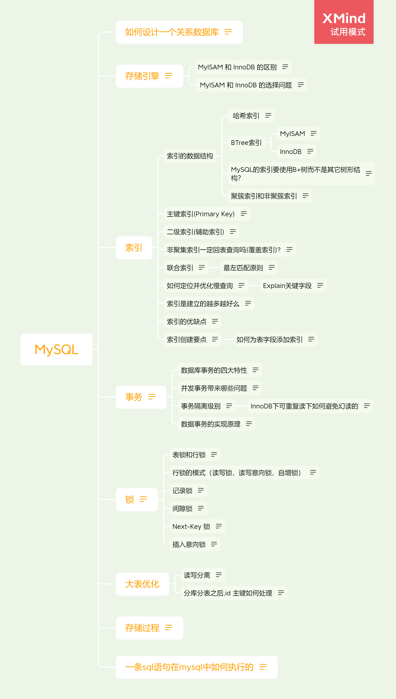
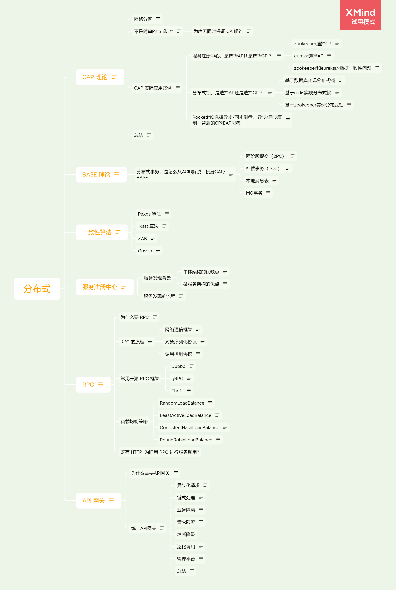
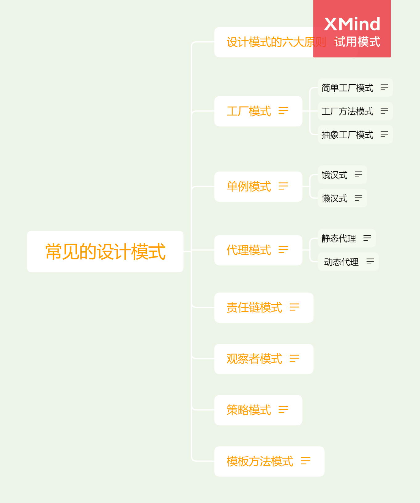
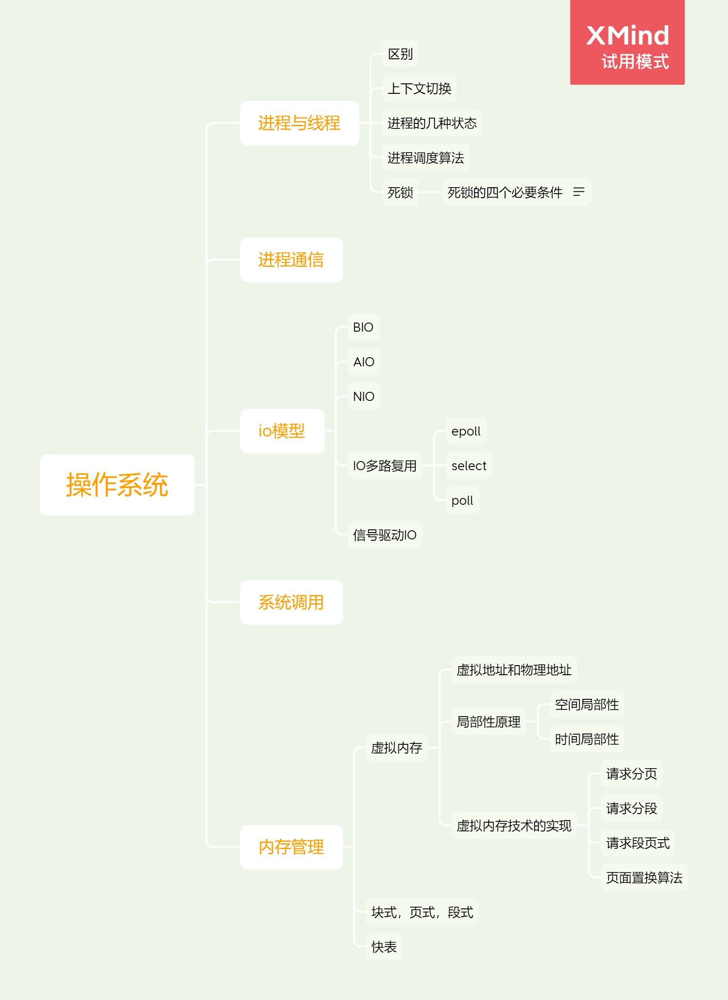
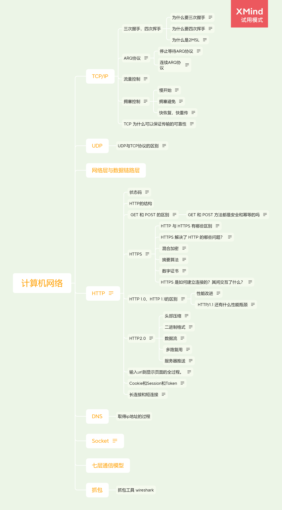

本思维导图，大多数材料来自Guide哥的JavaGuide，想看大部分材料源可直接点击此链接：https://gitee.com/SnailClimb/JavaGuide。

# Java

## Java基础
### 面向对象三大特性
### 数据类型
### 重载和重写
### 接口和抽象类的区别是什么？
### 常见关键字
### Java四种访问权限区别
## JVM
### 内存区域（运行时数据区）
### JMM(Java的内存模型)
### 类加载子系统
### JDK 监控和故障处理
## Java多线程
### Java线程基本状态
### 线程和进程
### 并发与并行的区别
### 程序计数器
### 上下文切换
### 并发编程的三个重要特性
### 死锁
### sleep() 方法和 wait() 方法区别和共同点
### 为什么我们调用 start() 方法时会执行 run() 方法，为什么我们不能直接调用 run() 方法？
### synchronized 关键字
### synchronized和ReentrantLock 的区别
### volatile 关键字
### ThreadLocal
### 线程池
### Atomic 原子类
### AQS
## Java集合
### List,Set,Map 三者的区别
### comparable 和 Comparator 的区别

